# Daily Market Analysis Workflow (V5)

3-step pipeline implementing the V5 Compute → Perception → Reasoning architecture:

| Layer | Step | Agent | Output |
|-------|------|-------|--------|
| Compute | Python scripts | uv run --frozen ashare-pilot indicators pool fetch / uv run --frozen ashare-pilot market-data quote / uv run --frozen ashare-pilot themes query | raw_observation + computed_perception |
| Perception | Step 1+2 | macro-strategist + sector-analyst | news.json -> compact theme evidence -> themes.json -> prepare -> mapper.annotations.json -> finalize -> mapper.strategy_view.json |
| Reasoning | Step 3 | portfolio-manager | strategy.json + daily_report.html (Direction / RiskSeverity / OverrideHint applied + ReasoningTrace) |

Step 2 NEVER produces Direction or RiskSeverity (V5 Invariant 1). Step 3 is the sole Reasoning layer.

## Workflow

```dot
digraph workflow {
    rankdir=TB;
    node [shape=box];

    // Step 1
    "Step 1: News Brief" [label="Step 1\nNews Brief\n(macro-strategist)", style=filled, fillcolor="#e6f3ff"];

    // Step 2 subgraph → Perception Layer
    subgraph cluster_step2 {
        label="Step 2: Perception\n(sector-analyst + daily-stock-mapping V5 skill)";
        style=filled;
        fillcolor="#fff3e6";
        color="#cc9933";
        fontsize=11;

        "2.1 Theme Extraction" [shape=box, style=filled, fillcolor="#fff3e6"];
        "2.2 Stock Pool Build" [shape=box, style=filled, fillcolor="#fff3e6"];
        "2.3 Technical Enrichment\n(Python V5 nested schema)" [shape=box, style=filled, fillcolor="#e6e6e6"];
        "2.4 Structured Dataset" [shape=box, style=filled, fillcolor="#fff3e6"];
    }

    // Step 3 → Reasoning Layer
    "Step 3: Reasoning" [label="Step 3\nReasoning Layer\n(portfolio-manager subagent\n+ daily-strategy V5 skill)\n\nDirection / RiskSeverity\nOverrideHint / ReasoningTrace", style=filled, fillcolor="#e6ffe6"];

    // Compute Layer (left)
    subgraph cluster_compute {
        label="Compute Layer (Python)";
        style=dashed;
        color="#666666";
        fontsize=10;

        "uv run --frozen ashare-pilot indicators pool fetch\n(V5 nested JSON)" [shape=folder, style=filled, fillcolor="#e6e6e6"];
        "uv run --frozen ashare-pilot market-data quote\n(auction)" [shape=folder, style=filled, fillcolor="#e6e6e6"];
        "uv run --frozen ashare-pilot market-data money-flow" [shape=folder, style=filled, fillcolor="#e6e6e6"];
        "uv run --frozen ashare-pilot market-data special\n(lhb)" [shape=folder, style=filled, fillcolor="#e6e6e6"];
        "uv run --frozen ashare-pilot themes query\n(candidates/market/pure)" [shape=folder, style=filled, fillcolor="#e6e6e6"];
    }

    // Skills (bottom)
    subgraph cluster_skills {
        label="Skills";
        style=dashed;
        color="#888888";
        fontsize=10;

        "daily-news-brief" [shape=folder, style=filled, fillcolor="#e6e6e6"];
        "daily-stock-mapping\n(V5 Perception)" [shape=folder, style=filled, fillcolor="#fff3e6"];
        "daily-strategy\n(V5 Reasoning)" [shape=folder, style=filled, fillcolor="#e6ffe6"];
        "theme-library" [shape=folder, style=filled, fillcolor="#e6e6e6"];
    }

    // Output files (right)
    subgraph cluster_outputs {
        label="Outputs (predict/{date}/)";
        style=dashed;
        color="#888888";

        "news.json + news.md" [shape=note, style=filled, fillcolor="#fffdeb"];
        "themes.json" [shape=note, style=filled, fillcolor="#fffdeb"];
        "theme_stocks.base.json\n(deterministic)" [shape=note, style=filled, fillcolor="#fffdeb"];
        "theme_stocks.json\n(validated contract)" [shape=note, style=filled, fillcolor="#fffdeb"];
        "mapper.annotations.json" [shape=note, style=filled, fillcolor="#fffdeb"];
        "mapper.json\n(full contract)" [shape=note, style=filled, fillcolor="#fffdeb"];
        "mapper.strategy_view.json\n(Step 3 input)" [shape=note, style=filled, fillcolor="#fffdeb"];
        "strategy.json + daily_report.html\n(+ReasoningTrace)" [shape=note, style=filled, fillcolor="#fffdeb"];
    }

    // Main pipeline flow
    "Step 1: News Brief" -> "2.1 Theme Extraction";
    "2.1 Theme Extraction" -> "2.2 Stock Pool Build";
    "2.2 Stock Pool Build" -> "2.3 Technical Enrichment\n(Python V5 nested schema)";
    "2.3 Technical Enrichment\n(Python V5 nested schema)" -> "2.4 Structured Dataset";
    "2.4 Structured Dataset" -> "Step 3: Reasoning";

    // Output file writes
    "Step 1: News Brief" -> "news.json + news.md";
    "2.1 Theme Extraction" -> "themes.json";
    "2.2 Stock Pool Build" -> "theme_stocks.base.json\n(deterministic)";
    "2.3 Technical Enrichment\n(Python V5 nested schema)" -> "theme_stocks.json\n(validated contract)";
    "2.4 Structured Dataset" -> "mapper.annotations.json";
    "2.4 Structured Dataset" -> "mapper.json\n(full contract)";
    "2.4 Structured Dataset" -> "mapper.strategy_view.json\n(Step 3 input)";
    "Step 3: Reasoning" -> "strategy.json + daily_report.html\n(+ReasoningTrace)";

    // Skill feeds
    "daily-news-brief" -> "Step 1: News Brief";
    "daily-stock-mapping\n(V5 Perception)" -> "2.1 Theme Extraction";
    "daily-strategy\n(V5 Reasoning)" -> "Step 3: Reasoning";
    "theme-library" -> "2.1 Theme Extraction";
    "theme-library" -> "2.2 Stock Pool Build";

    // Compute feeds
    "uv run --frozen ashare-pilot indicators pool fetch\n(V5 nested JSON)" -> "2.3 Technical Enrichment\n(Python V5 nested schema)";
    "uv run --frozen ashare-pilot market-data quote\n(auction)" -> "2.3 Technical Enrichment\n(Python V5 nested schema)";
    "uv run --frozen ashare-pilot market-data money-flow" -> "2.4 Structured Dataset";
    "uv run --frozen ashare-pilot market-data special\n(lhb)" -> "2.2 Stock Pool Build";
    "uv run --frozen ashare-pilot themes query\n(candidates/market/pure)" -> "2.2 Stock Pool Build";

    // Inter-stage file reads (dashed)
    "themes.json" -> "2.2 Stock Pool Build" [style=dashed];
    "theme_stocks.json\n(validated contract)" -> "2.4 Structured Dataset" [style=dashed];
    "news.json + news.md" -> "2.1 Theme Extraction" [style=dashed];
    "mapper.strategy_view.json\n(Step 3 input)" -> "Step 3: Reasoning" [style=dashed];

    // V5 architecture annotation
    { rank=same; "2.1 Theme Extraction" "2.2 Stock Pool Build" "2.3 Technical Enrichment\n(Python V5 nested schema)" "2.4 Structured Dataset" }
    {
        label="V5 Architecture: Compute (Python) → Perception (Steps 1-2) → Reasoning (Step 3) → Decision (strategy.json + daily_report.html)";
        shape=plaintext;
        fontsize=11;
    }
}
```



---

## Execution Timing

This pipeline runs at any time. Data availability depends on market state — the table below shows the pre-market baseline. When running intraday, all data types are available.

| Data Type | Source | Pre-market? | Note |
|-----------|--------|:----------:|------|
| News / policy / events | uv run --frozen ashare-pilot news fetch | ✓ | Morning news, overnight developments |
| Theme stock pools | uv run --frozen ashare-pilot themes query | ✓ | Industry leaders, candidates, pure stocks — pre-built offline library |
| Market observation | uv run --frozen ashare-pilot themes query market | ✓* | Cross-rank highlights + attention + gainers from concept cache snapshots |
| Technical indicators (MA/MACD/RSI/BB/ATR) | uv run --frozen ashare-pilot indicators calculate | ✓ | MA20(boll)/MA50, MACD, RSI, Bollinger %B, ATR — based on yesterday's close |
| Yesterday's turnover (成交额) | uv run --frozen ashare-pilot indicators calculate | ✓ | Last K-line record's `amount` |
| Auction data (竞价涨幅/金额/量) | uv run --frozen ashare-pilot market-data quote | ✓* | `percent`(竞价涨幅), `amount`(竞价金额), `volume`(竞价量); 9:15-9:25 call auction only |
| Today's intraday price/volume | — | ✗ | Requires active trading |
| Today's money flow | — | ✗ | Yesterday's data via uv run --frozen ashare-pilot market-data money-flow (intraday: real-time available) |
| Today's volume_ratio/swing | — | ✗ | Requires intraday trading |

## Performance Constraints

**DO NOT** use `uv run --frozen ashare-pilot market-data stocks all` in this pipeline. It fetches ~5500 stocks and takes 30-60s — too slow for pre-market delivery.

All data fetching targets ONLY stocks in the pool (theme library candidates + news-mentioned), typically 30-50 stocks. Never fetch full market data.

Target wall-clock: Step 1 (news) + Step 2 (mapping) + Step 3 (strategy) must complete before 9:30 AM. Parallel bash calls are the primary optimization — each individual script call is fast (~3s), the bottleneck is sequential execution.

---

## Step 1: News Briefing

**Agent:** `macro-strategist`

**Outputs:** `predict/{YYYY}-{MM}-{DD}/news.json` and `predict/{YYYY}-{MM}-{DD}/news.md`

**Task:**

- Fetch news once from all sources via `daily-news-brief` and write both files:
  `uv run --frozen ashare-pilot news fetch --date {YYYY-MM-DD} --output-dir predict/{YYYY-MM-DD}`
- Before Step 2, require `predict/{YYYY-MM-DD}/news.json` to exist. If it is
  missing, stop and rerun Step 1. No separate schema validation is required
  because `news.json` is generated deterministically by the fetch script.
- `news.json` is the canonical evidence contract. IDs are globally increasing
  integers and downstream references must use `news#<id>`.
- Generate or reorganize `news.md` as the readable briefing: market overview,
  economic data, policy updates, and key events. Never renumber or replace the
  IDs in `news.json` based on the Markdown layout.
- Today is `{CURRENT_DATE}` — use actual current date, never hardcoded or knowledge-cutoff dates

**Required Step 1 gate:** before dispatching Step 2, run:

```bash
test -f predict/{YYYY-MM-DD}/news.json
```

If this fails, rerun the Step 1 fetch command. Do not dispatch Step 2 with only
`news.md` present.

---

## Step 2: Stock Data Mapping (Perception Layer)

**Agent:** `sector-analyst`

**Action:** Load skill `daily-stock-mapping` (V5 Perception) and follow its workflow.

**V5 note:** Step 2 has two LLM semantic stages only: `themes.json` and candidate-complete sparse `mapper.annotations.json`. Scripts own membership, source flags, default Pattern, assembly, and validation. Step 2 NEVER produces Direction、RiskSeverity、or OverrideHint — these are solely Step 3 Reasoning territory.

Before theme extraction, build the compact high-recall input. After `themes.json`, prepare deterministic inputs; after sparse annotations, finalize:

```bash
uv run --frozen ashare-pilot mapping daily build-theme-evidence --date {YYYY-MM-DD}
# LLM writes themes.json from the compact input
uv run --frozen ashare-pilot mapping daily prepare --date {YYYY-MM-DD}
# LLM writes candidate-complete sparse mapper.annotations.json
uv run --frozen ashare-pilot mapping daily finalize --date {YYYY-MM-DD}
```

**Prompt (exact format, MUST NOT deviate):**

```
Load skill `daily-stock-mapping` and execute.

Date: {YYYY-MM-DD}

Inputs:
- predict/{YYYY-MM-DD}/news.json
- predict/{YYYY-MM-DD}/news.md

Outputs:
- predict/{YYYY-MM-DD}/themes.json
- predict/{YYYY-MM-DD}/theme_stocks.extra.json (optional supplemental source)
- predict/{YYYY-MM-DD}/theme_stocks.universe.json
- predict/{YYYY-MM-DD}/theme_stocks.base.json
- predict/{YYYY-MM-DD}/theme_stocks.json
- predict/{YYYY-MM-DD}/mapper.annotations.json
- predict/{YYYY-MM-DD}/mapper.json
- predict/{YYYY-MM-DD}/mapper.strategy_view.json
```

**CRITICAL:** Do NOT inline any file content, scoring formulas, filter rules, or analysis. Keep the prompt clean.

**Outputs:** `themes.json`, `theme_stocks.json`, `mapper.annotations.json`, `mapper.json`, `mapper.strategy_view.json`, and report-only `step2_timing.json`

---

## Step 3: Trading Strategy (Reasoning Layer)

**Agent:** `portfolio-manager`

**Action:** Execute the following one unambiguous prepare → selected-only LLM draft → finalize sequence.

```bash
uv run --frozen ashare-pilot strategy daily prepare \
  --date {YYYY-MM-DD}
```

**portfolio-manager prompt (exact format, MUST NOT deviate):**

```
Date: {YYYY-MM-DD}

Read only:
- predict/{YYYY-MM-DD}/.strategy_llm_input.json
- .agents/skills/daily-strategy/references/strategy-selection-rubric.md
- .agents/skills/daily-strategy/references/strategy-output-contract.md
- memory/RULES.md (when present)
- memory/SHARED_RULES.md (when present)

In a zero-history project, missing memory files mean there are no learned
rules yet. Continue from current-day evidence and do not invent rule history.

Consider every compact candidate, deep-reason only the final regime-limited
selection, and write:
- predict/{YYYY-MM-DD}/strategy.draft.json
```

The LLM must not open full `mapper.json`, `pool_indicators.json`, `news.json`, or any Markdown report. It retains final regime, code set/order, Direction, RiskSeverity application, rating, rule application, and selected execution-plan ownership.

```bash
uv run --frozen ashare-pilot strategy daily finalize \
  --date {YYYY-MM-DD} \
  --llm-duration {MEASURED_PORTFOLIO_MANAGER_SECONDS}
```

If draft validation fails, send only the reported draft errors back to portfolio-manager, rewrite `strategy.draft.json`, increment `--validation-retries`, and rerun finalize with the newly measured cumulative LLM duration. Do not hand-edit `strategy.json`. Runs without an explicit measured LLM duration are diagnostic only and must not enter Gate D P95 samples.

**Output:** `predict/{YYYY}-{MM}-{DD}/strategy.json` (`daily_strategy.v2`) and `predict/{YYYY}-{MM}-{DD}/daily_report.html`

---

## Output Files

| File | Content | Layer / Step |
|------|---------|-------------|
| `predict/{date}/news.json` | Canonical fetched news with global incremental IDs (`daily_news.v1`) | Perception (Step 1) |
| `predict/{date}/news.md` | LLM-readable briefing; report only, not an evidence contract | Perception (Step 1) |
| `predict/{date}/themes.json` | Matched themes with heat/confidence sub-scores (`daily_themes.v1`) | Perception (Step 2.1) |
| `predict/{date}/theme_stocks.extra.json` | Optional LLM supplemental stocks for market/news/LHB sources | Perception (Step 2.2 input) |
| `predict/{date}/theme_stocks.universe.json` | Script-built pre-indicator stock universe for `uv run --frozen ashare-pilot indicators pool fetch` | Perception (Step 2.2 bridge) |
| `predict/{date}/theme_stocks.base.json` | Script-built deterministic stock-pool base with scope and filters | Perception (Step 2.2-2.3) |
| `predict/{date}/theme_stocks.json` | Validated stock-pool machine contract (`daily_theme_stocks.v1`) | Perception (Step 2.2-2.3) |
| `predict/{date}/mapper.annotations.json` | LLM-owned Step 2 perception annotations (`daily_mapper_annotations.v1`) | Perception (Step 2.4) |
| `predict/{date}/mapper.json` | Full validated Step 2 machine contract (`daily_mapper.v1`) | Perception (Step 2.4) |
| `predict/{date}/mapper.strategy_view.json` | Compact Step 3 reading contract (`daily_strategy_input.v1`) projected from mapper.json | Perception → Reasoning bridge |
| `predict/{date}/step2_timing.json` | Report-only stage duration, byte, failure, and count diagnostics | Observability |
| `predict/{date}/.strategy_llm_input.json` | Non-contract compact all-candidate Step 3 decision input | Step 3 workflow |
| `predict/{date}/strategy.draft.json` | Non-contract selected-only LLM decisions linked by content hash | Step 3 workflow |
| `predict/{date}/step3_timing.json` | Report-only prepare/LLM/finalize timing and artifact fingerprints | Observability |
| `predict/{date}/strategy.json` | Conditional pre-open decisions for review/backtests and operation confirmation (`daily_strategy.v2`) | Reasoning (Step 3) |
| `predict/{date}/daily_report.html` | Daily readable summary rendered from JSON: themes, strategy table, stock details, observation/excluded pools, referenced news | Reasoning (Step 3 readable output) |

## Quick Reference

| Layer | Step | Agent | Input | Output | Key V5 constraint |
|-------|------|-------|-------|--------|-------------------|
| Perception | 1 | macro-strategist + daily-news-brief | — | news.json + news.md | news.json must exist before Step 2 |
| Perception | 2 | sector-analyst + daily-stock-mapping V5 | canonical news.json | compact input -> themes.json -> prepare -> mapper.annotations.json -> finalize -> mapper.strategy_view.json | **No Direction / RiskSeverity** (Invariant 1) |
| Reasoning | 3 | portfolio-manager + daily-strategy V5 | compact all-candidate input + RULES/SHARED_RULES | selected-only draft -> strategy.json + daily_report.html | Final decisions remain LLM-owned; Python completes deterministic contracts |

Phase 3 uses the exact prepare → portfolio-manager draft → finalize sequence above. Full source JSON remains outside the hot LLM context.

## Common Usage

- "Get today's market analysis"
- "Run daily analysis workflow"
- "Generate trading recommendations"
- "/daily-new-analysis"

## Notes

- Each step depends on previous output
- Directory: `predict/{YYYY}-{MM}-{DD}/` (e.g., `predict/2026-04-07/`)
- All output in Chinese (中文)
- **V5 architecture:** Compute (Python) → Perception (Steps 1-2) → Reasoning (Step 3) → Decision (`strategy.json` + `daily_report.html`)
- `uv run --frozen ashare-pilot indicators pool fetch` outputs V5 nested JSON (`raw_observation` + `computed_perception` each with `{value, confidence, trace}` per field)
- Step 2 NEVER produces Direction / RiskSeverity — Step 3 is the sole Reasoning authority
- Daily pipeline runs at any time; data availability depends on market state (see § Execution Timing)
