# Intraday Trading Review (尾盘复盘 Workflow)

Verify yesterday's intraday overnight strategy predictions against actual next-day (T+1) market data, extract lessons, update rules, and persist to memory.

For a zero-history project, missing memory files mean no accumulated rules or
performance history. Write the first factual verification from actual market
results; do not create template rules or claim prior validation.

## Workflow Overview

```dot
digraph workflow {
    rankdir=LR;
    node [shape=box];

    "Step 1: Read Strategy" [label="Step 1\nRead Intraday Strategy\n(intraday/{date}/overnight_strategy.json\n+ intraday_mapper.json)", style=filled, fillcolor="#e6f3ff"];
    "Step 2: Fetch Actuals" [label="Step 2\nFetch T+1 Prices\n(stock-analysis skill)", style=filled, fillcolor="#fff3e6"];
    "Step 3: Compare & Analyze" [label="Step 3\nCompare & Analyze\n(performance-analyst)", style=filled, fillcolor="#e6ffe6"];
    "Step 4: Write Memory" [label="Step 4\nWrite to Memory\n(memory/intraday/{date}/)", style=filled, fillcolor="#ffe6ff"];

    "intraday/{date}/\novernight_strategy.json" [shape=note];
    "intraday/{date}/\nintraday_mapper.json" [shape=note];
    "memory/intraday/{date}/\nintraday_verification.md" [shape=note];
    "memory/intraday/INDEX.md" [shape=note];
    "memory/INTRADAY_RULES.md" [shape=note];
    "memory/SHARED_RULES.md" [shape=note];

    "Step 1: Read Strategy" -> "intraday/{date}/\novernight_strategy.json";
    "Step 1: Read Strategy" -> "intraday/{date}/\nintraday_mapper.json";
    "intraday/{date}/\novernight_strategy.json" -> "Step 2: Fetch Actuals";
    "Step 2: Fetch Actuals" -> "Step 3: Compare & Analyze";
    "Step 3: Compare & Analyze" -> "memory/intraday/{date}/\nintraday_verification.md";
    "memory/intraday/{date}/\nintraday_verification.md" -> "Step 4: Write Memory";
    "Step 4: Write Memory" -> "memory/intraday/INDEX.md";
    "Step 4: Write Memory" -> "memory/INTRADAY_RULES.md";
    "Step 4: Write Memory" -> "memory/SHARED_RULES.md";
}
```



## Timing

| 事件 | 时间 | 说明 |
|------|------|------|
| 策略制定 | T日 14:30-14:50 | intraday pipeline 运行，形成可行动推荐 |
| 复盘窗口 | T+1日 9:30 开盘后 | 验证推荐的基准表现，提取教训 |
| 复盘完成 | T+1日 10:00 前 | 规则更新在当天尾盘策略中使用 |

**日期约定:** 复盘的 strategy date 是昨天 (T)，verification 文件写入 `memory/intraday/{T}/intraday_verification.md`。

## Execution Steps

### Step 1: Read Yesterday's Intraday Strategy

**Action:** Read `intraday/{YYYY}-{MM}-{DD}/overnight_strategy.json` **AND** `intraday/{YYYY}-{MM}-{DD}/intraday_mapper.json`

使用上一个交易日的日期 — 例如今天 7-3 复盘 7-2 的尾盘策略。

只接受：

- `overnight_strategy.json.schema_version=intraday_overnight_strategy.v3`
- `intraday_mapper.json.schema_version=intraday_mapper.v3`

在读取复盘字段前先执行：

```bash
uv run --frozen ashare-pilot strategy overnight validate \
  --date YYYY-MM-DD \
  --input intraday/YYYY-MM-DD/overnight_strategy.json \
  --mapper intraday/YYYY-MM-DD/intraday_mapper.json
```

验证失败时停止复盘，不得从未验证或非精确投影的策略生成绩效结论。

**What to extract from `overnight_strategy.json`:**

- **Market Context**: `market_assessment`、`strategy`、`data_quality`、
  `recall_quality`
- **Recommendations**: `execution_role=primary` 的可行动 executable 股票，其方向、
  结构化止损、文字止盈、ReasoningTrace 与 RulesApplied
- **Eligible Watchlist**: executable 中的 `alternative` 和 `watch`，全部为
  `观望`；alternative 单独记录替代观察结果，不能视为同时执行或实际推荐；
  `stop_loss_basis` 必须是 `not_applicable`
- **Observations**: 确定性观察池及 `score_status`、
  `observation_reasons`、观察摘要与复核条件

**What to extract from `intraday_mapper.json`:**

- **Executable Pool**: `executable_stocks`，用于复核系统排序与
  recommendations / eligible_watchlist 的 Reasoning 分流
- **Score Trace**: `score_trace` 的 9 个维度，用于评估评分质量
- **Observation Pool**: `observation_stocks`；其中
  `score_status=unscored` 的股票没有 score/rank，不得参与评分质量统计

**汇总目标股票池:**

| 来源 | 类型 | 用途 |
|------|------|------|
| `recommendations` | 可行动推荐 | 计算 T 收盘到 T+1 的基准表现，复核止损与 T+1 计划 |
| `eligible_watchlist` | 备选或合格观察 | alternative 单独记录替代结果，watch 评估机会成本；均不计入推荐胜率 |
| `observations` | 确定性观察 | 分开评估执行门槛失败和数据缺失；unscored 不评价评分质量 |

---

### Step 2: Fetch Actual Market Data

**Target stocks:** 汇总 Step 1 提取的所有股票代码

**For each stock, fetch:**

1. **T+1 行情快照**: 开盘价、截至复盘时点的最高价、最低价、当前价；
   收盘后复盘才可使用正式收盘价
   ```bash
   uv run --frozen ashare-pilot market-data quote CODE1,CODE2,... --json
   ```

2. **T 日收盘基准价** (yesterday's close): 作为统一、可复现的隔夜收益基准

   **调用规范**

   ```bash
   uv run --frozen ashare-pilot market-data history CODE \
     --start STRATEGY_DATE --end REVIEW_DATE --json
   ```

   - `CODE` 为单个 A 股代码；多个标的逐只调用。
   - `STRATEGY_DATE` 取被复盘策略的目录日期，`REVIEW_DATE` 取实际复盘日期，格式均为 `YYYYMMDD`。
   - 若按相对区间查询，`--range` 格式为“正整数 + 单位”，单位支持 `d`、`w`、`m`、`y`
     （例如 `5d`、`2w`、`3m`、`1y`）。
   - T+1 指 T 之后的首个交易日，不是自然日加一天。按 `date` 排序后，以日期等于策略日的记录作为
     T 日 K 线，以其后的第一条记录作为 T+1 K 线。
   - 周末、节假日或停牌导致 T 之后没有有效 K 线时，不得用自然日数据或更早记录代替；
     应标记为“暂无 T+1 行情”，待下一条有效交易记录产生后再复盘。

   **JSON 输出格式**

   ```json
   [
     {
       "date": "YYYY-MM-DD",
       "open": "0.00",
       "close": "0.00",
       "high": "0.00",
       "low": "0.00",
       "change": "0.00",
       "change_pct": "0.00",
       "volume": "0",
       "amount": "0.00",
       "turnover": "0.00"
     }
   ]
   ```

3. **T+1 竞价数据** (if available): 开盘价 vs 昨日收盘价 → 涨跌幅
   从 `uv run --frozen ashare-pilot market-data quote` 实时行情中提取 `open` / `prev_close`

必须记录行情快照时间。10:00 前的复盘将实时 `price` 标为“T+1 快照价”，
不得称为“T+1 收盘价”；当日 high/low 也只能解释为截至快照时点的数据。

`overnight_strategy.v3` 不提供实际成交记录、仓位百分比、数值买入区间或数值目标价。
除非另有真实成交凭证，否则不得声称“实际买入”“未买入”“目标价命中”或
“实际持仓收益”。所有收益统一标注为 **T 日收盘基准收益**。

**Verify for each recommendation:**

| 检查项 | 数据来源 | 判断标准 |
|--------|----------|----------|
| 止损触及 | T+1 截至快照最低价 | 最低价 ≤ `t_plus_1_plan.stop_loss_price` |
| 竞价表现 | T+1 开盘价 vs T 日收盘价 | 竞价涨跌幅及是否符合文字 `auction_condition` |
| 盘中表现 | T+1 截至快照高低价 | 结合 `open_strategy`、`take_profit` 做证据化评价 |
| 基准收益 | T+1 标记价 vs T 日收盘价 | `(T+1 mark / T close - 1) × 100%` |

---

### Step 3: Compare & Analyze

**Required analysis sections:**

#### 3a. Recommendation Benchmark Performance

| 代码 | 名称 | 方向 | T日收盘 | T+1开盘 | 截至快照最高 | 截至快照最低 | T+1标记价 | 基准收益 | 止损触及 |
|------|------|:----:|:-------------:|:------:|:------:|:------:|:------:|:------:|:----:|

结果分类:
- **正收益** (>+0.5%)
- **基本平盘** (±0.5%)
- **负收益** (<-0.5%)
- **止损触及**: 单独记录；不得把无法确认执行顺序的行情区间推断成实际成交结果

累积统计:
- 推荐正收益率: X/Y = XX%
- 等权平均基准收益: X%
- 最大收益 / 最大亏损
- 止损触及数: X/Y

V3 不提供账户仓位信息，只计算等权基准收益。

#### 3b. Alternative / Watch Counterfactual Review

| 代码 | 名称 | Score | Rank Tier | 降级依据 | T+1基准收益 | 评价 |
|------|------|:-----:|:---------:|----------|:-----------:|------|

评价:

- **降级避损**: T+1 明显下跌
- **降级中性**: T+1 基本平盘
- **降级踏空**: T+1 明显上涨；结合 `reasoning_trace` 和
  `rules_applied` 判断错误来源

Alternative 和 watch 均没有可行动止损。Alternative 必须单独记录其替代观察
结果，不得算作实际推荐；watch 继续作为机会成本观察。两者均不得计入
recommendation 正收益率、止损触及率或 recommendation 基准收益。

#### 3c. T+1 Exit Plan Verification

对每只 recommendation 验证 `t_plus_1_plan`:

```
Stock [code] [name]:
  竞价实际: [+/-X%]
  匹配场景: [竞价高开/平开/低开 + 触发条件]
  计划操作: [持有/减半/止损]
  截至快照基准结果: [正收益/平盘/负收益]
  ─────────────────
  兑现计划评价: ✅ 正确 / ❌ 需修正
```

重点评估:
- 竞价场景匹配度
- 止损位设定是否合理（过紧→过早止损 / 过松→亏损大）
- 文字止盈计划是否与盘中高点、收盘回撤相符

`auction_condition`、`open_strategy` 和 `take_profit` 是文字计划。
评价必须引用原文与实际行情，不得把文字条件改写成策略中不存在的数值阈值。

#### 3d. Observation Pool Review (踏空与门控分析)

| 代码 | 名称 | Score | 观望原因 | T+1涨幅 | 评价 |
|------|------|:----:|----------|:------:|------|

按 `score_status` 分组评价:

- **观望正确**: 次日横盘/下跌 → 不买是对的
- **踏空**: 次日大涨(>5%) → 错失机会，分析是否需要调整规则
- **观望合理**: 涨停封板 / 板排除 → 即使涨了也不后悔（不可交易）
- **数据结论不可得**: `score_status=unscored`；只评价数据门控，不评价分数高低

#### 3e. Scoring Quality Assessment

从 mapper 合并以下样本：

- 全部 `executable_stocks`
- `observation_stocks` 中 `score_status=scored` 的股票

排除 `score_status=unscored`、缺少 `overnight_score` 或暂无 T+1 行情的
记录。对 `overnight_score` 与统一快照时点的 T+1 基准收益计算 Spearman
rank correlation，并同时报告样本量与快照时间；样本过少时只做描述性分析，
不输出强结论。

```
Spearman rank correlation: score rank vs T+1 benchmark return
- score 与基准收益正相关 → 评分有效
- score 与基准收益无关/负相关 → 评分维度需审视
```

分维度分析:
- 哪些维度 (SourceCapitalProxy/Capital/Tail/Position/Intensity/Conviction/Consistency/TrendQuality) 与 T+1 收益相关性最强
- Risk penalty 是否合理（高分扣到低分但实际大涨 → 扣分过度）
- scored observation 中因绝对地板或执行门槛被排除的股票是否大涨
- unscored 股票只能用于数据门控召回分析，不能验证评分维度

#### 3f. Rule Effectiveness Assessment

仅评估 `recommendations` 和 `eligible_watchlist` 中 `rules_applied`
明确列出的规则。`observations` 没有 Direction、Tradeability 或交易规则，
不得把确定性观察原因记作规则触发。

| 规则/分支 | Eligible | Triggered | Regime | 触发标的 | 规则动作 | 对照动作 | T+1结果 | 经济效果 | 判断 | 证据引用 |
|-----------|:--------:|:---------:|--------|----------|----------|----------|---------|----------|:----:|----------|

判断:
- ✅ 规则正确: 规则指引与实际结果一致
- ❌ 规则失效: 规则指引与实际结果相反
- ⚠️ 部分有效: 方向对但幅度/时机需调整

重点关注的 intraday 规则 (from INTRADAY_RULES.md):
- I01 (Tradeability): 四态分类是否准
- I04 (Extension 风险): 位置过高降级是否正确
- I05 (隔夜风险边界): Score 阈值是否合理
- I06 (T+1 兑现概率): 兑现概率判断是否准
- I08 (轮动判定): 轮动信号是否有效

以及共享规则:
- R42.d (原 R74，恐慌模式 MA20 缓冲区)
- R45 (防御板块失效)
- R36 (非主线降级)

#### 3g. New Lessons & Rule Updates

提取 actionable 规则:

| 规则 | 来源证据 | 适用场景 |
|------|----------|----------|
| Ixx | 今天 X 股票 Y 现象导致 Z 结果 | 何时触发 |

单日新发现只能进入 `INTRADAY_RULES.md` 或 `SHARED_RULES.md` 的候选区，不执行、不计容量。满足两个独立交易日、预注册字段和碰撞检查后，才能进入观察中。未触发不得计为正向验证。

---

### Step 4: Write to Memory

#### 4a. Write Verification File

**Output:** `memory/intraday/{YYYY}-{MM}-{DD}/intraday_verification.md`

使用昨天（策略日期）的日期。

**File format:**

```markdown
# 尾盘复盘 {YYYY}-{MM}-{DD}

> 复盘日期: {T+1 YYYY-MM-DD} | 策略日期: {T YYYY-MM-DD}

## 一、Recommendations 基准表现

**推荐正收益率**: X/Y = XX%  |  **等权平均基准收益**: +X%  |  **最大上涨**: X% (stock)  |  **最大下跌**: X% (stock)

| 代码 | 名称 | 方向 | T日收盘 | T+1开盘 | T+1标记价 | 基准收益 | 止损触及 | 结果 |
...

## 二、Eligible Watchlist 降级复盘

...

## 三、T+1 兑现验证

...

## 四、Deterministic Observations 复盘

...

## 五、评分质量评估

...

## 六、规则有效性

| 规则/分支 | Eligible | Triggered | Regime | 触发标的 | 规则动作 | 对照动作 | 判断 | 经济效果 | 证据引用 |
...

## 七、关键教训

### 1. ...

**证据**: ...

**规则建议**: ...

## 八、规则状态更新

需更新 INTRADAY_RULES.md / SHARED_RULES.md 的规则:

| 规则 | 操作 | 原因 |
...

## 九、T+1 评分系统反馈

基于今日验证对评分的改进建议:
...
```

#### 4b. Update intraday/INDEX.md

在 `memory/intraday/INDEX.md` 中对应日期行追加复盘结果:

```markdown
| {MM-DD} | {Regime} | {Top Recommendation 或零推荐} | {Rank Tier} | {Score} | [intraday_mapper](../../intraday/{YYYY-MM-DD}/intraday_mapper.json) → 复盘: recommendations {N}/{M}正收益, {key_result} |
```

#### 4c. Update Rule Files

- **新发现**: 添加到对应文件候选区，不执行；单日事件不得直接成为观察规则
- **已有规则**: 按合格触发机会更新证据和状态；未触发不进入分母
- **规则修正**: 先读 `memory/RULE_GOVERNANCE.md`，更新预注册、旧编号映射和退役摘要
- **版本替代**: 新版本仍为候选时旧版继续执行；新版本获准后旧版退出正文

#### 4d. Update PERFORMANCE.md

在 `memory/PERFORMANCE.md` 中更新 Intraday 板块:

- 尾盘 recommendations 月度正收益率
- 关键日期记录 (全胜日 / 全败日 / 规则突破日)

## Output Files

| File | Content | Generated By |
|------|---------|--------------|
| `memory/intraday/{date}/intraday_verification.md` | Detailed intraday verification | Step 3+4 |
| `memory/intraday/INDEX.md` (updated) | Index entry with review results | Step 4b |
| `memory/INTRADAY_RULES.md` (updated) | New rules or status changes | Step 4c |
| `memory/SHARED_RULES.md` (updated) | New shared rules or status changes | Step 4c |
| `memory/PERFORMANCE.md` (updated) | Cumulative intraday performance | Step 4d |

## Quick Reference

| Step | Action | Input | Output |
|------|--------|-------|--------|
| 1 | Read Strategy | validated v3 `overnight_strategy.json` + `intraday_mapper.json` | Extracted primary recommendations, alternative/watch list, observations, rules, scores |
| 2 | Fetch Actuals | Stock codes from strategy | T/T+1 price data |
| 3 | performance-analyst analysis | Predictions + actuals | Full comparison report |
| 4 | Write Memory | Analysis report | `memory/intraday/{date}/intraday_verification.md` + INDEX/RULES updates |

## Common Usage

- "复盘昨天的尾盘策略"
- "intraday review"
- "尾盘复盘"
- "验证隔夜持仓"
- "昨天的 overnight strategy 表现怎么样"
- "Run intraday trading review for 2026-07-02"

## Important Notes

- **Execute after market open (9:30+) on T+1**, not same-day after close
- **BEFORE** generating analysis → READ `memory/INTRADAY_RULES.md` (尾盘规则) **AND** `memory/SHARED_RULES.md` (通用规则) to understand existing rules and cumulative validation counts
- **BEFORE** changing any rule or lifecycle status → READ `memory/RULE_GOVERNANCE.md`
- **AFTER** generating review:
   - Write verification to `memory/intraday/{YYYY-MM-DD}/intraday_verification.md` (使用策略日期)
  - Update `memory/intraday/INDEX.md` with review results
  - Update `memory/INTRADAY_RULES.md` (尾盘规则) or `memory/SHARED_RULES.md` (通用规则) depending on rule scope
- The strategy date (T) and review date (T+1) are different — verification file uses the strategy date
- If the strategy file does not exist, report error and suggest running intraday-market-analysis first
- Reject any schema other than `intraday_overnight_strategy.v3` /
  `intraday_mapper.v3`; V1/V2 files are archives/fixtures only and have no
  production review compatibility path
- Without actual fills, all return figures are T-close benchmarks, not realized
  account P&L; never invent buy zones, target prices, execution rates, or
  numeric position weights
- Track eligible opportunities, triggered outcomes, economic effect, and evidence references; do not count non-triggered days as positive validation
- Output in Chinese (中文)
- Unlike Morning review, Intraday review focuses on **overnight recommendation benchmark performance** and **T+1 exit plan verification**, not multi-day swing trading
