# Daily Market Analysis Workflow

3-step pipeline: news briefing → theme-driven stock mapping → trading strategy.

## Workflow

```dot
digraph workflow {
    rankdir=TB;
    node [shape=box];

    // Step 1
    "Step 1: News Brief" [label="Step 1\nNews Brief\n(financial-news-analyst)", style=filled, fillcolor="#e6f3ff"];

    // Step 2 subgraph
    subgraph cluster_step2 {
        label="Step 2: Stock Mapping (financial-news-mapper)";
        style=filled;
        fillcolor="#fff3e6";
        color="#cc9933";

        "2.1 Theme Extraction" [shape=box, style=filled, fillcolor="#fff3e6"];
        "2.2 Stock Pool Build" [shape=box, style=filled, fillcolor="#fff3e6"];
        "2.3 Technical Enrichment" [shape=box, style=filled, fillcolor="#fff3e6"];
        "2.4 Impact Analysis" [shape=box, style=filled, fillcolor="#fff3e6"];
    }

    // Step 3
    "Step 3: Strategy" [label="Step 3\nTrading Strategy\n(trading-strategist subagent\n+ daily-strategy skill)", style=filled, fillcolor="#e6ffe6"];

    // Data sources (left)
    subgraph cluster_datasources {
        label="Data Sources";
        style=dashed;
        color="#888888";

        "daily-news-brief" [shape=folder, style=filled, fillcolor="#e6e6e6"];
        "theme-library" [shape=folder, style=filled, fillcolor="#e6e6e6"];
        "query_theme.py\n(market)" [shape=folder, style=filled, fillcolor="#fff3e6"];
        "fetch_stock.py\n(auction)" [shape=folder, style=filled, fillcolor="#e6e6e6"];
        "fetch_indicators.py\n(MA/MACD/RSI/BB/ATR)" [shape=folder, style=filled, fillcolor="#e6e6e6"];
        "fetch_money_flow.py\n(yesterday)" [shape=folder, style=filled, fillcolor="#e6e6e6"];
        "fetch_special.py\n(lhb)" [shape=folder, style=filled, fillcolor="#e6e6e6"];
        "daily-stock-mapping\nskill" [shape=folder, style=filled, fillcolor="#fff3e6"];
        "daily-strategy\nskill" [shape=folder, style=filled, fillcolor="#e6ffe6"];
    }

    // Output files (right)
    subgraph cluster_outputs {
        label="Outputs (predict/{date}/)";
        style=dashed;
        color="#888888";

        "news.md" [shape=note, style=filled, fillcolor="#fffdeb"];
        "themes.md" [shape=note, style=filled, fillcolor="#fffdeb"];
        "theme_stocks.md\n(enriched)" [shape=note, style=filled, fillcolor="#fffdeb"];
        "mapper.md" [shape=note, style=filled, fillcolor="#fffdeb"];
        "strategy.md" [shape=note, style=filled, fillcolor="#fffdeb"];
    }

    // Main pipeline flow
    "Step 1: News Brief" -> "2.1 Theme Extraction";
    "2.1 Theme Extraction" -> "2.2 Stock Pool Build";
    "2.2 Stock Pool Build" -> "2.3 Technical Enrichment";
    "2.3 Technical Enrichment" -> "2.4 Impact Analysis";
    "2.4 Impact Analysis" -> "Step 3: Strategy";

    // Output file writes
    "Step 1: News Brief" -> "news.md";
    "2.1 Theme Extraction" -> "themes.md";
    "2.3 Technical Enrichment" -> "theme_stocks.md\n(enriched)";
    "2.4 Impact Analysis" -> "mapper.md";
    "Step 3: Strategy" -> "strategy.md";

    // Data source feeds
    "daily-news-brief" -> "Step 1: News Brief";
        "theme-library" -> "2.1 Theme Extraction";
        "theme-library" -> "2.2 Stock Pool Build";
        "query_theme.py\n(market)" -> "2.2 Stock Pool Build";
    "fetch_stock.py\n(auction)" -> "2.3 Technical Enrichment";
    "fetch_indicators.py\n(MA/MACD/RSI/BB/ATR)" -> "2.3 Technical Enrichment";
    "fetch_money_flow.py\n(yesterday)" -> "2.4 Impact Analysis";
    "fetch_special.py\n(lhb)" -> "2.2 Stock Pool Build";
    "daily-stock-mapping\nskill" -> "2.1 Theme Extraction";
    "daily-strategy\nskill" -> "Step 3: Strategy";

    // Inter-stage file reads (dashed)
    "themes.md" -> "2.2 Stock Pool Build" [style=dashed];
    "theme_stocks.md\n(enriched)" -> "2.4 Impact Analysis" [style=dashed];
    "news.md" -> "2.1 Theme Extraction" [style=dashed];
    "mapper.md" -> "Step 3: Strategy" [style=dashed];
}
```



---

## Execution Timing

This pipeline runs at any time. Data availability depends on market state — the table below shows the pre-market baseline. When running intraday, all data types are available.

| Data Type | Source | Pre-market? | Note |
|-----------|--------|:----------:|------|
| News / policy / events | fetch_news.py | ✓ | Morning news, overnight developments |
| Theme stock pools | query_theme.py | ✓ | Industry leaders, candidates, pure stocks — pre-built offline library |
| Market observation | query_theme.py market | ✓* | Cross-rank highlights + attention + gainers from concept cache snapshots |
| Technical indicators (MA/MACD/RSI/BB/ATR) | fetch_indicators.py | ✓ | MA20(boll)/MA50, MACD, RSI, Bollinger %B, ATR — based on yesterday's close |
| Yesterday's turnover (成交额) | fetch_indicators.py | ✓ | Last K-line record's `amount` |
| Auction data (竞价涨幅/金额/量) | fetch_stock.py | ✓* | `percent`(竞价涨幅), `amount`(竞价金额), `volume`(竞价量); 9:15-9:25 call auction only |
| Today's intraday price/volume | — | ✗ | Requires active trading |
| Today's money flow | — | ✗ | Yesterday's data via fetch_money_flow.py (intraday: real-time available) |
| Today's volume_ratio/swing | — | ✗ | Requires intraday trading |

## Performance Constraints

**DO NOT** use `fetch_all_astocks.py` in this pipeline. It fetches ~5500 stocks and takes 30-60s — too slow for pre-market delivery.

All data fetching targets ONLY stocks in the pool (theme library candidates + news-mentioned), typically 30-50 stocks. Never fetch full market data.

Target wall-clock: Step 1 (news) + Step 2 (mapping) + Step 3 (strategy) must complete before 9:30 AM. Parallel bash calls are the primary optimization — each individual script call is fast (~3s), the bottleneck is sequential execution.

---

## Step 1: News Briefing

**Agent:** `financial-news-analyst`

**Output:** `predict/{YYYY}-{MM}-{DD}/news.md`

**Task:**

- Fetch news from all sources via `daily-news-brief` skill (hotspot, flash, finance, macro, sentiment)
- Generate structured briefing: market overview, economic data, policy updates, key events
- Today is `{CURRENT_DATE}` — use actual current date, never hardcoded or knowledge-cutoff dates

---

## Step 2: Stock Data Mapping

**Agent:** `financial-news-mapper`

**Action:** Load skill `daily-stock-mapping` and follow its workflow.

**Prompt (exact format, MUST NOT deviate):**

```
Load skill `daily-stock-mapping` and execute.

Date: {YYYY-MM-DD}

Inputs:
- predict/{YYYY-MM-DD}/news.md

Outputs:
- predict/{YYYY-MM-DD}/themes.md
- predict/{YYYY-MM-DD}/theme_stocks.md (enriched in-place)
- predict/{YYYY-MM-DD}/mapper.md
```

**CRITICAL:** Do NOT inline any file content, scoring formulas, filter rules, or analysis. Keep the prompt clean.

**Output:** `predict/{YYYY}-{MM}-{DD}/mapper.md`

---

## Step 3: Trading Strategy

**Agent:** `trading-strategist`

**Action:** Load skill `daily-strategy` and follow its workflow.

**Prompt (exact format, MUST NOT deviate):**

```
Load skill `daily-strategy` and execute.

Date: {YYYY-MM-DD}

Inputs:
- predict/{YYYY-MM-DD}/mapper.md

Output:
- predict/{YYYY-MM-DD}/strategy.md
```

**CRITICAL:** Do NOT inline any file content, data summaries, stock tables, rules, formulas, or analysis. Keep the prompt clean.

**Output:** `predict/{YYYY}-{MM}-{DD}/strategy.md`

---

## Output Files

| File | Content | Step |
|------|---------|------|
| `predict/{date}/news.md` | News briefing, market overview, key events | 1 |
| `predict/{date}/themes.md` | Matched themes with heat/confidence | 2.1 |
| `predict/{date}/theme_stocks.md` | Deduplicated stock pool with technicals | 2.2-2.3 |
| `predict/{date}/mapper.md` | Composite-scored stock analysis report | 2.4 |
| `predict/{date}/strategy.md` | 10 stock predictions with ratings and price targets + inline market context | 3 |

## Quick Reference

| Step | Agent | Input | Output |
|------|-------|-------|--------|
| 1 | financial-news-analyst | - | news.md |
| 2 | financial-news-mapper + daily-stock-mapping skill | news.md | themes.md → theme_stocks.md → mapper.md |
| 3 | trading-strategist + daily-strategy skill | mapper.md | strategy.md (含 market context) |

## Common Usage

- "Get today's market analysis"
- "Run daily analysis workflow"
- "Generate trading recommendations"
- "/daily-new-analysis"

## Notes

- Each step depends on previous output
- Directory: `predict/{YYYY}-{MM}-{DD}/` (e.g., `predict/2026-04-07/`)
- All output in Chinese (中文)