# Daily Market Analysis Workflow (V5)

3-step pipeline implementing the V5 Compute → Perception → Reasoning architecture:

| Layer | Step | Agent | Output |
|-------|------|-------|--------|
| Compute | Python scripts | fetch_pool_indicators.py / fetch_stock.py / query_theme.py | raw_observation + computed_perception |
| Perception | Step 1+2 | macro-strategist + sector-analyst | news.md → themes.md → theme_stocks.md → mapper.md |
| Reasoning | Step 3 | portfolio-manager | strategy.md (Direction / RiskSeverity / OverrideHint applied + ReasoningTrace) |

Step 2 NEVER produces Direction or RiskSeverity (V5 Invariant 1). Step 3 is the sole Reasoning layer.

## Workflow

```dot
digraph workflow {
    rankdir=TB;
    node [shape=box];

    // Step 1
    "Step 1: News Brief" [label="Step 1\nNews Brief\n(macro-strategist)", style=filled, fillcolor="#e6f3ff"];

    // Step 2 subgraph → Perception Layer
    subgraph cluster_step2 {
        label="Step 2: Perception\n(sector-analyst + daily-stock-mapping V5 skill)";
        style=filled;
        fillcolor="#fff3e6";
        color="#cc9933";
        fontsize=11;

        "2.1 Theme Extraction" [shape=box, style=filled, fillcolor="#fff3e6"];
        "2.2 Stock Pool Build" [shape=box, style=filled, fillcolor="#fff3e6"];
        "2.3 Technical Enrichment\n(Python V5 nested schema)" [shape=box, style=filled, fillcolor="#e6e6e6"];
        "2.4 Structured Dataset" [shape=box, style=filled, fillcolor="#fff3e6"];
    }

    // Step 3 → Reasoning Layer
    "Step 3: Reasoning" [label="Step 3\nReasoning Layer\n(portfolio-manager subagent\n+ daily-strategy V5 skill)\n\nDirection / RiskSeverity\nOverrideHint / ReasoningTrace", style=filled, fillcolor="#e6ffe6"];

    // Compute Layer (left)
    subgraph cluster_compute {
        label="Compute Layer (Python)";
        style=dashed;
        color="#666666";
        fontsize=10;

        "fetch_pool_indicators.py\n(V5 nested JSON)" [shape=folder, style=filled, fillcolor="#e6e6e6"];
        "fetch_stock.py\n(auction)" [shape=folder, style=filled, fillcolor="#e6e6e6"];
        "fetch_money_flow.py" [shape=folder, style=filled, fillcolor="#e6e6e6"];
        "fetch_special.py\n(lhb)" [shape=folder, style=filled, fillcolor="#e6e6e6"];
        "query_theme.py\n(candidates/market/pure)" [shape=folder, style=filled, fillcolor="#e6e6e6"];
    }

    // Skills (bottom)
    subgraph cluster_skills {
        label="Skills";
        style=dashed;
        color="#888888";
        fontsize=10;

        "daily-news-brief" [shape=folder, style=filled, fillcolor="#e6e6e6"];
        "daily-stock-mapping\n(V5 Perception)" [shape=folder, style=filled, fillcolor="#fff3e6"];
        "daily-strategy\n(V5 Reasoning)" [shape=folder, style=filled, fillcolor="#e6ffe6"];
        "theme-library" [shape=folder, style=filled, fillcolor="#e6e6e6"];
    }

    // Output files (right)
    subgraph cluster_outputs {
        label="Outputs (predict/{date}/)";
        style=dashed;
        color="#888888";

        "news.md" [shape=note, style=filled, fillcolor="#fffdeb"];
        "themes.md" [shape=note, style=filled, fillcolor="#fffdeb"];
        "theme_stocks.md\n(enriched)" [shape=note, style=filled, fillcolor="#fffdeb"];
        "mapper.md\n(V5 7-section)" [shape=note, style=filled, fillcolor="#fffdeb"];
        "strategy.md\n(+ReasoningTrace)" [shape=note, style=filled, fillcolor="#fffdeb"];
    }

    // Main pipeline flow
    "Step 1: News Brief" -> "2.1 Theme Extraction";
    "2.1 Theme Extraction" -> "2.2 Stock Pool Build";
    "2.2 Stock Pool Build" -> "2.3 Technical Enrichment\n(Python V5 nested schema)";
    "2.3 Technical Enrichment\n(Python V5 nested schema)" -> "2.4 Structured Dataset";
    "2.4 Structured Dataset" -> "Step 3: Reasoning";

    // Output file writes
    "Step 1: News Brief" -> "news.md";
    "2.1 Theme Extraction" -> "themes.md";
    "2.3 Technical Enrichment\n(Python V5 nested schema)" -> "theme_stocks.md\n(enriched)";
    "2.4 Structured Dataset" -> "mapper.md\n(V5 7-section)";
    "Step 3: Reasoning" -> "strategy.md\n(+ReasoningTrace)";

    // Skill feeds
    "daily-news-brief" -> "Step 1: News Brief";
    "daily-stock-mapping\n(V5 Perception)" -> "2.1 Theme Extraction";
    "daily-strategy\n(V5 Reasoning)" -> "Step 3: Reasoning";
    "theme-library" -> "2.1 Theme Extraction";
    "theme-library" -> "2.2 Stock Pool Build";

    // Compute feeds
    "fetch_pool_indicators.py\n(V5 nested JSON)" -> "2.3 Technical Enrichment\n(Python V5 nested schema)";
    "fetch_stock.py\n(auction)" -> "2.3 Technical Enrichment\n(Python V5 nested schema)";
    "fetch_money_flow.py" -> "2.4 Structured Dataset";
    "fetch_special.py\n(lhb)" -> "2.2 Stock Pool Build";
    "query_theme.py\n(candidates/market/pure)" -> "2.2 Stock Pool Build";

    // Inter-stage file reads (dashed)
    "themes.md" -> "2.2 Stock Pool Build" [style=dashed];
    "theme_stocks.md\n(enriched)" -> "2.4 Structured Dataset" [style=dashed];
    "news.md" -> "2.1 Theme Extraction" [style=dashed];
    "mapper.md\n(V5 7-section)" -> "Step 3: Reasoning" [style=dashed];

    // V5 architecture annotation
    { rank=same; "2.1 Theme Extraction" "2.2 Stock Pool Build" "2.3 Technical Enrichment\n(Python V5 nested schema)" "2.4 Structured Dataset" }
    {
        label="V5 Architecture: Compute (Python) → Perception (Steps 1-2) → Reasoning (Step 3) → Decision (strategy.md)";
        shape=plaintext;
        fontsize=11;
    }
}
```



---

## Execution Timing

This pipeline runs at any time. Data availability depends on market state — the table below shows the pre-market baseline. When running intraday, all data types are available.

| Data Type | Source | Pre-market? | Note |
|-----------|--------|:----------:|------|
| News / policy / events | fetch_news.py | ✓ | Morning news, overnight developments |
| Theme stock pools | query_theme.py | ✓ | Industry leaders, candidates, pure stocks — pre-built offline library |
| Market observation | query_theme.py market | ✓* | Cross-rank highlights + attention + gainers from concept cache snapshots |
| Technical indicators (MA/MACD/RSI/BB/ATR) | fetch_indicators.py | ✓ | MA20(boll)/MA50, MACD, RSI, Bollinger %B, ATR — based on yesterday's close |
| Yesterday's turnover (成交额) | fetch_indicators.py | ✓ | Last K-line record's `amount` |
| Auction data (竞价涨幅/金额/量) | fetch_stock.py | ✓* | `percent`(竞价涨幅), `amount`(竞价金额), `volume`(竞价量); 9:15-9:25 call auction only |
| Today's intraday price/volume | — | ✗ | Requires active trading |
| Today's money flow | — | ✗ | Yesterday's data via fetch_money_flow.py (intraday: real-time available) |
| Today's volume_ratio/swing | — | ✗ | Requires intraday trading |

## Performance Constraints

**DO NOT** use `fetch_all_astocks.py` in this pipeline. It fetches ~5500 stocks and takes 30-60s — too slow for pre-market delivery.

All data fetching targets ONLY stocks in the pool (theme library candidates + news-mentioned), typically 30-50 stocks. Never fetch full market data.

Target wall-clock: Step 1 (news) + Step 2 (mapping) + Step 3 (strategy) must complete before 9:30 AM. Parallel bash calls are the primary optimization — each individual script call is fast (~3s), the bottleneck is sequential execution.

---

## Step 1: News Briefing

**Agent:** `macro-strategist`

**Output:** `predict/{YYYY}-{MM}-{DD}/news.md`

**Task:**

- Fetch news from all sources via `daily-news-brief` skill (hotspot, flash, finance, macro, sentiment)
- Generate structured briefing: market overview, economic data, policy updates, key events
- Today is `{CURRENT_DATE}` — use actual current date, never hardcoded or knowledge-cutoff dates

---

## Step 2: Stock Data Mapping (Perception Layer)

**Agent:** `sector-analyst`

**Action:** Load skill `daily-stock-mapping` (V5 Perception) and follow its workflow.

**V5 note:** Step 2 is the Perception Layer per V5 Invariant 1. It produces `mapper.md` as a structured perception dataset (7 sections) with per-field confidence. Step 2 NEVER produces Direction、RiskSeverity、or OverrideHint — these are solely Step 3 Reasoning territory.

After the Step 2 agent writes `mapper.md`, it MUST run the Strategy Inputs
injection/validation script:

```bash
python .opencode/skills/daily-stock-mapping/scripts/inject_strategy_inputs.py --date {YYYY-MM-DD}
```

If the script prints `VALIDATION_FAILED_REGENERATE_MAPPER`, the Step 2 agent
must regenerate the reported mapper/Candidate Pool alignment and rerun the
script. Do not advance to Step 3 with an unvalidated `Strategy Inputs` table;
this is an LLM regeneration loop, not a hard pipeline block.

**Prompt (exact format, MUST NOT deviate):**

```
Load skill `daily-stock-mapping` and execute.

Date: {YYYY-MM-DD}

Inputs:
- predict/{YYYY-MM-DD}/news.md

Outputs:
- predict/{YYYY-MM-DD}/themes.md
- predict/{YYYY-MM-DD}/theme_stocks.md (enriched in-place)
- predict/{YYYY-MM-DD}/mapper.md
```

**CRITICAL:** Do NOT inline any file content, scoring formulas, filter rules, or analysis. Keep the prompt clean.

**Output:** `predict/{YYYY}-{MM}-{DD}/mapper.md`

---

## Step 3: Trading Strategy (Reasoning Layer)

**Agent:** `portfolio-manager`

**Action:** Load skill `daily-strategy` (V5 Reasoning) and follow its workflow.

**V5 note:** Step 3 is the sole Reasoning Layer. It consumes V5 `mapper.md` computed perceptions (value + confidence + trace) and produces Direction、RiskSeverity、OverrideHint application、ReasoningTrace and strategy. Conditional Reread via NewsLink pointers only — never full news.md scan.

**Prompt (exact format, MUST NOT deviate):**

```
Load skill `daily-strategy` and execute.

Date: {YYYY-MM-DD}

Inputs:
- predict/{YYYY-MM-DD}/mapper.md

Output:
- predict/{YYYY-MM-DD}/strategy.md
```

**CRITICAL:** Do NOT inline any file content, data summaries, stock tables, rules, formulas, or analysis. Keep the prompt clean.

**Output:** `predict/{YYYY}-{MM}-{DD}/strategy.md`

---

## Output Files

| File | Content | Layer / Step |
|------|---------|-------------|
| `predict/{date}/news.md` | News briefing, market overview, key events | Perception (Step 1) |
| `predict/{date}/themes.md` | Matched themes with heat/confidence sub-scores | Perception (Step 2.1) |
| `predict/{date}/theme_stocks.md` | Deduplicated stock pool with technicals + Pattern 5-dim states | Perception (Step 2.2-2.3) |
| `predict/{date}/mapper.md` | V5 7-section perception dataset: Market State, Theme Ranking, Candidate Pool (prefix columns with confidence), Strategy Inputs, Score Trace, Observation Pool, Excluded Stocks | Perception (Step 2.4) |
| `predict/{date}/strategy.md` | Reasoning result: Direction / RiskSeverity / OverrideHint 应用 + Buy/Stop/Target + ReasoningTrace + Market Context (RegimeHint) | Reasoning (Step 3) |

## Quick Reference

| Layer | Step | Agent | Input | Output | Key V5 constraint |
|-------|------|-------|-------|--------|-------------------|
| Perception | 1 | macro-strategist + daily-news-brief | — | news.md | — |
| Perception | 2 | sector-analyst + daily-stock-mapping V5 | news.md | themes.md → theme_stocks.md → mapper.md | **No Direction / RiskSeverity** (Invariant 1) |
| Reasoning | 3 | portfolio-manager + daily-strategy V5 | mapper.md + RULES.md | strategy.md (+ReasoningTrace) | Default no full news.md reread (Invariant 2) |

## Common Usage

- "Get today's market analysis"
- "Run daily analysis workflow"
- "Generate trading recommendations"
- "/daily-new-analysis"

## Notes

- Each step depends on previous output
- Directory: `predict/{YYYY}-{MM}-{DD}/` (e.g., `predict/2026-04-07/`)
- All output in Chinese (中文)
- **V5 architecture:** Compute (Python) → Perception (Steps 1-2) → Reasoning (Step 3) → Decision (strategy.md formatted output)
- `fetch_pool_indicators.py` outputs V5 nested JSON (`raw_observation` + `computed_perception` each with `{value, confidence, trace}` per field)
- Step 2 NEVER produces Direction / RiskSeverity — Step 3 is the sole Reasoning authority
- Daily pipeline runs at any time; data availability depends on market state (see § Execution Timing)
