# Daily Trading Review (复盘 Workflow)

Verify today's strategy predictions against actual market data, extract lessons, update rules, and persist to memory.

## Workflow Overview

```dot
digraph workflow {
    rankdir=LR;
    node [shape=box];

    "Step 1: Read Strategy" [label="Step 1\nRead Strategy\n(predict/{date}/strategy.md)", style=filled, fillcolor="#e6f3ff"];
    "Step 2: Fetch Actuals" [label="Step 2\nFetch Actual Prices\n(stock-analysis skill)", style=filled, fillcolor="#fff3e6"];
    "Step 3: Compare & Analyze" [label="Step 3\nCompare & Analyze\n(trading-strategist)", style=filled, fillcolor="#e6ffe6"];
    "Step 4: Write Memory" [label="Step 4\nWrite to Memory\n(memory/daily/{date}/)", style=filled, fillcolor="#ffe6ff"];

    "predict/{date}/strategy.md" [shape=note];
    "memory/daily/{date}/\nverification.md" [shape=note];
    "memory/daily/INDEX.md" [shape=note];
    "memory/RULES.md" [shape=note];

    "Step 1: Read Strategy" -> "predict/{date}/strategy.md";
    "predict/{date}/strategy.md" -> "Step 2: Fetch Actuals";
    "Step 2: Fetch Actuals" -> "Step 3: Compare & Analyze";
    "Step 3: Compare & Analyze" -> "memory/daily/{date}/\nverification.md";
    "memory/daily/{date}/\nverification.md" -> "Step 4: Write Memory";
    "Step 4: Write Memory" -> "memory/daily/INDEX.md";
    "Step 4: Write Memory" -> "memory/RULES.md";
}
```



## Execution Steps

### Step 1: Read Today's Strategy

**Action:** Read `predict/{YYYY}-{MM}-{DD}/strategy.md`

**What to extract:**
- Date and analysis scope
- Market environment judgment (强势/弱势/震荡)
- 3 super predictions (stock code, direction, buy zone, target, stop loss, rating)
- 7 buy/sell recommendations
- 10 stock prediction list
- Risk management section
- Historical lessons applied section

---

### Step 2: Fetch Actual Market Data

**Agent:** `stock-analysis` skill (fetch real-time and intraday data)

**Target stocks:** All stocks from the 10-stock prediction list + any mentioned in super predictions

**For each stock, fetch:**
- Today's closing price (or current price if during trading hours)
- Intraday K-line data (5-min scale) to analyze open/high/low/close patterns
- Verify whether predictions hit buy zone, target price, or stop-loss

**Note:** Use the stock-analysis skill scripts:
```
python .opencode/skills/stock-analysis/scripts/fetch_stock.py CODE1,CODE2,... --json
python .opencode/skills/stock-analysis/scripts/fetch_stock.py CODE --intraday --scale 5 --json
```

---

### Step 3: Compare & Analyze (用trading-strategist复盘)

**Agent:** `trading-strategist` (opus)

**Task:** Perform detailed comparison between predictions and actual market results.

**Required analysis sections:**

#### 3a. Buy Recommendation Results Table

| Stock | Rating | Direction | Buy Zone | Actual Close | Result | Return |
|-------|--------|-----------|----------|-------------|--------|--------|

Results: **成功** (price stayed in/above buy zone, profit achieved), **部分成功** (hit buy zone but small profit/loss), **失败** (broke stop loss or never hit buy zone), **观望正确/踏空** (for hold recommendations)

For **5-star ratings**: Track cumulative success rate across history.

#### 3b. Super Prediction Verification

For each of the 3 super predictions, analyze:
- Direction correctness (看涨/看跌 was right or wrong)
- Buy zone accuracy (did price enter the recommended zone)
- Target price (did it reach target)
- Stop loss (was it triggered)
- Core logic validation (was the thesis correct)

#### 3c. Hold/Watch Recommendations Review

For each 观望 recommendation:
- Was the decision to wait correct?
- Did the stock become a missed opportunity (踏空)?
- Was the RSI超买/涨停观望 rule correctly applied?

#### 3d. Rule Effectiveness Assessment

Evaluate each rule that was applied in the strategy's "历史教训应用" section:

| Rule | Applied To | Result | Verdict | Cumulative Count |
|------|-----------|--------|---------|-----------------|

- **Verdict**: ✅ 正确 / ❌ 失效 / ⚠️ 部分有效
- **Cumulative Count**: e.g., "第32次验证" for repeated rules

Key rules to always check:
- 涨停股统一观望 (gap-up stocks wait rule)
- 高开超+3%降级 (gap-up >3% downgrade)
- RSI超买回避 (RSI overbought avoidance)
- 弱势市场5星降级 (weak market 5-star downgrade)
- 涨停股次日平开是入场机会 (gap-up stock next-day flat open entry)
- 概念驱动优于跟随逻辑 (concept-driven > following logic)

#### 3e. New Lessons & Rule Updates

Extract **actionable rules** from today's results. Each new rule must include:
- **规则**: One-sentence rule statement
- **Why**: Evidence from today's data (specific example)
- **How to apply**: Concrete operational guidance

---

### Step 4: Write to Memory

Memory uses the following structure (see `memory/MEMORY.md` for full guide):

```
memory/
├── MEMORY.md              ← Navigation hub
├── RULES.md               ← Trading rules (active/observation/retired)
├── PERFORMANCE.md         ← Cumulative performance stats
└── daily/
    ├── INDEX.md           ← Daily record index (reverse chronological)
    └── YYYY-MM-DD/
        ├── strategy.md    ← (legacy) historical strategy, or use predict/
        └── verification.md ← Verification report
```

#### 4a. Write Verification File

**Output file:** `memory/daily/{YYYY}-{MM}-{DD}/verification.md`

**File format:**

```markdown
# 验证复盘 {YYYY}-{MM}-{DD}

## 结果

**买入成功率**: X/Y = XX%
**5星成功率**: X/Y = XX% (累计第N次验证)
**观望正确率**: X/Y = XX%

...

## 关键教训

### 1. <Lesson Title>

**Why**: ...

**How to apply**: ...

...

## 规则触发记录

| 规则编号 | 规则名称 | 触发标的 | 结果 | 累计验证次数 |
|----------|----------|----------|------|:----------:|

...

## 次日策略调整

...
```

#### 4b. Update daily/INDEX.md

Append new entry at the top of the table in `memory/daily/INDEX.md`:

```markdown
| {MM-DD} | 验证 | <buy success rate>, <key winners/losers>, <new rules added> | [`verification`]({YYYY-MM-DD}/verification.md) |
```

If a strategy file also exists in `predict/`, also add:

```markdown
| {MM-DD} | 策略 | <top 3 picks summary> | [`strategy`](../../predict/{YYYY-MM-DD}/strategy.md) |
```

#### 4c. Update RULES.md (if new rules or rule status changes)

- **New rule discovered**: Add to "观察中" section with `⚠️ 首验` status
- **Rule status change**: Update status emoji and verification count
- **Rule retirement**: Move rule to deprecated section with reason

#### 4d. Update PERFORMANCE.md (periodically)

- Update monthly success rate after each verification (incrementally)
- Add notable dates to the key dates index if today is significant (e.g., all-win, all-loss, rule breakthrough)

## Output Files

| File | Content | Generated By |
|------|---------|--------------|
| `memory/daily/{date}/verification.md` | Detailed verification with results, lessons, rule triggers | Step 3+4 |
| `memory/daily/INDEX.md` (updated) | Index entry linking to verification file | Step 4b |
| `memory/RULES.md` (updated) | New rules or rule status changes | Step 4c |

## Quick Reference

| Step | Action | Input | Output |
|------|--------|-------|--------|
| 1 | Read Strategy | `predict/{date}/strategy.md` | Extracted predictions |
| 2 | Fetch Actuals | Stock codes from strategy | Real-time/intraday prices |
| 3 | trading-strategist analysis | Predictions + actuals | Full comparison report |
| 4 | Write Memory | Analysis report | `memory/daily/{date}/verification.md` + update INDEX.md/RULES.md |

## Common Usage

User requests:
- "复盘今天的预测"
- "Run daily review / 复盘"
- "Verify today's strategy"
- "总结今天的教训"
- "Update memory"
- "今天的预测怎么样？验证一下"

## Important Notes

- Run after market close for full-day data, or intraday for partial verification
- **BEFORE** generating analysis → READ `memory/RULES.md` to understand existing rules and cumulative validation counts
- **AFTER** generating review:
  - Write verification to `memory/daily/{YYYY-MM-DD}/verification.md`
  - Append entry to `memory/daily/INDEX.md`
  - Update `memory/RULES.md` if new rules or status changes
- Cumulative rule counts should be tracked (e.g., "第32次验证")
- Output in Chinese (中文输出)
- If today's strategy file does not exist yet, report error and suggest running daily-market-analysis first
