---
name: daily-trading-review
description: Review today's trading predictions against actual market results. Compare strategy recommendations with real price movements, extract lessons, update rules, and write structured verification to memory. Trigger after market close or when user asks for 复盘/verification/review.
---

# Daily Trading Review (复盘 Workflow)

Verify today's strategy predictions against actual market data, extract lessons, update rules, and persist to memory.

## Workflow Overview

```dot
digraph workflow {
    rankdir=LR;
    node [shape=box];

    "Step 1: Read Strategy" [label="Step 1\nRead Strategy\n(predict/{date}/strategy.md)", style=filled, fillcolor="#e6f3ff"];
    "Step 2: Fetch Actuals" [label="Step 2\nFetch Actual Prices\n(stock-analysis skill)", style=filled, fillcolor="#fff3e6"];
    "Step 3: Compare & Analyze" [label="Step 3\nCompare & Analyze\n(trading-strategist)", style=filled, fillcolor="#e6ffe6"];
    "Step 4: Write Memory" [label="Step 4\nWrite to Memory\n(memory/daily/{date}/)", style=filled, fillcolor="#ffe6ff"];

    "predict/{date}/strategy.md" [shape=note];
    "memory/daily/{date}/\nverification.md" [shape=note];
    "memory/daily/INDEX.md" [shape=note];
    "memory/SHARED_RULES.md" [shape=note];
    "memory/RULES.md" [shape=note];

    "Step 1: Read Strategy" -> "predict/{date}/strategy.md";
    "predict/{date}/strategy.md" -> "Step 2: Fetch Actuals";
    "Step 2: Fetch Actuals" -> "Step 3: Compare & Analyze";
    "Step 3: Compare & Analyze" -> "memory/daily/{date}/\nverification.md";
    "memory/daily/{date}/\nverification.md" -> "Step 4: Write Memory";
    "Step 4: Write Memory" -> "memory/daily/INDEX.md";
    "Step 4: Write Memory" -> "memory/RULES.md";
    "Step 4: Write Memory" -> "memory/SHARED_RULES.md";
}
```



## Execution Steps

### Step 1: Read Today's Strategy

**Action:** Read `predict/{YYYY}-{MM}-{DD}/strategy.md`

**What to extract:**
- Date and analysis scope
- Market environment judgment (强势/弱势/震荡)
- 3 super predictions (stock code, direction, buy zone, target, stop loss, rating)
- 7 buy/sell recommendations
- 10 stock prediction list
- Risk management section
- Historical lessons applied section

---

### Step 2: Fetch Actual Market Data

**Agent:** `stock-analysis` skill (fetch real-time and intraday data)

**Target stocks:** All stocks from the 10-stock prediction list + any mentioned in super predictions

**For each stock, fetch:**
- Today's closing price (or current price if during trading hours)
- Intraday K-line data (5-min scale) to analyze open/high/low/close patterns
- **开盘 / 最低 / 盘中最高 / 收盘** four raw prices (mandatory — populate the Schema-Locked table in 3a)
- **首根5分K线形态** (09:35 first candle) relative to the entry anchor — needed to classify `首根K确认` (企稳/击穿/未触及)
- Verify whether predictions hit buy zone, target price, or stop-loss

**Note:** Use the stock-analysis skill scripts:
```
python .opencode/lib/fetch/fetch_stock.py CODE1,CODE2,... --json
python .opencode/lib/fetch/fetch_stock.py CODE --intraday --scale 5 --json
```

---

### Step 3: Compare & Analyze (用trading-strategist复盘)

**Agent:** `trading-strategist` (opus)

**Task:** Perform detailed comparison between predictions and actual market results.

**Required analysis sections:**

#### 3a. Buy Recommendation Results Table (Schema-Locked — 禁止增删列 / 改列名 / 改列序)

> **为什么锁死**: 历史复盘表列名随日期漂移(有的缺最低、有的用名称当主键、买区用 en-dash),导致 `entry_quality_backtest.py` 无法确定性解析。本表列定义固定,所有价格取自 Step 2 的 5 分钟分时,单元格内**只放数值,不加括号/文字注释**。

| # | 代码 | 名称 | 评级 | 策略 | 入场锚 | 开盘 | 最低 | 盘中最高 | 收盘 | 触及 | 首根K确认 | 利润给回% | 结果 |
|---|------|------|:---:|------|--------|:---:|:---:|:---:|:---:|:---:|:---:|:---:|:---:|

**列规范(逐列强制)**:

| 列 | 允许值 / 格式 | 说明 |
|----|--------------|------|
| `代码` | `sh`/`sz`+6位 | 机器主键。**禁止填名称**;bj/688 不入表 |
| `策略` | `趋势跟随｜回调布局｜强势接力｜防御布局｜暂不参与` | 照抄 strategy.md「交易策略」列 |
| `入场锚` | `类型:价格` | 类型∈`MA5｜MA20｜ZONE｜追入｜OPEN`;价格=买区上沿**单值**。例 `MA20:41.62`、`MA5:899.81`、`追入:66.06`。策略=暂不参与→填 `—` |
| `开盘/最低/盘中最高/收盘` | 数值,2位小数 | 5分钟分时原始价,纯数字 |
| `触及` | `是｜否` | 判据:`最低 ≤ 入场锚`(追入/OPEN 恒为 `是`) |
| `首根K确认` **(NEW)** | `企稳｜击穿｜未触及` | 09:35 首根5分K相对入场锚:收在锚上/放量收复=`企稳`;跌破锚且缩量续跌=`击穿`;全天未到锚=`未触及` |
| `利润给回%` **(NEW)** | 数值1位 或 `—` | 触及=是:`(盘中最高−收盘)/入场锚×100`;否则 `—`。**人读用,脚本以原始价重算为准** |
| `结果` | `成功｜部分成功｜失败｜踏空｜观望正确` | 成功=触及且持收盈利;部分成功=触及但薄利/回吐;失败=击穿止损或触及后亏;踏空=未触及但上涨;观望正确=未触及且下跌 |

> **派生指标不手填**: `MAE%`(入场后被套=`(最低−入场锚)/入场锚`)、`持收%`(=`(收盘−入场锚)/入场锚`)由 `.opencode/skills/daily-trading-review/scripts/entry_quality_backtest.py` 从上表**原始列自动计算**——避免手算错误(历史曾出现把买区解析成 8 位数的脏值)。
>
> **为何加 `首根K确认`**: 入场质量回测(2026-06~07)显示,回踩成交后中位 +4.25%/胜率 69%,锚本身有效;拖累质量的是"触即破"的击穿单(占成交 31%)。`首根K确认`把"站稳 vs 击穿"记为结构化字段,是未来验证"确认闸门"能否同时留赢家、滤输家的关键数据。

For **5-star ratings**: Track cumulative success rate across history.

#### 3b. Super Prediction Verification

For each of the 3 super predictions, analyze:
- Direction correctness (看涨/看跌 was right or wrong)
- Buy zone accuracy (did price enter the recommended zone)
- Target price (did it reach target)
- Stop loss (was it triggered)
- Core logic validation (was the thesis correct)

#### 3c. Hold/Watch Recommendations Review

For each 观望 recommendation:
- Was the decision to wait correct?
- Did the stock become a missed opportunity (踏空)?
- Was the RSI超买/涨停观望 rule correctly applied?

#### 3d. Rule Effectiveness Assessment

Evaluate each rule that was applied in the strategy's "历史教训应用" section:

| Rule | Applied To | Result | Verdict | Cumulative Count |
|------|-----------|--------|---------|-----------------|

- **Verdict**: ✅ 正确 / ❌ 失效 / ⚠️ 部分有效
- **Cumulative Count**: e.g., "第32次验证" for repeated rules

Key rules to always check:
- 涨停股统一观望 (gap-up stocks wait rule)
- 高开超+3%降级 (gap-up >3% downgrade)
- RSI超买回避 (RSI overbought avoidance)
- 弱势市场5星降级 (weak market 5-star downgrade)
- 涨停股次日平开是入场机会 (gap-up stock next-day flat open entry)
- 概念驱动优于跟随逻辑 (concept-driven > following logic)

#### 3e. New Lessons & Rule Updates

Extract **actionable rules** from today's results. Each new rule must include:
- **规则**: One-sentence rule statement
- **Why**: Evidence from today's data (specific example)
- **How to apply**: Concrete operational guidance

---

### Step 4: Write to Memory

Memory uses the following structure (see `memory/MEMORY.md` for full guide):

```
memory/
├── MEMORY.md              ← Navigation hub
├── SHARED_RULES.md        ← General rules (Morning + Intraday)
├── RULES.md               ← Morning-specific rules (竞价/开盘/首根K线)
├── INTRADAY_RULES.md      ← Intraday/T+1 rules
├── PERFORMANCE.md         ← Cumulative performance stats
└── daily/
    ├── INDEX.md           ← Daily record index (reverse chronological)
    └── YYYY-MM-DD/
        ├── verification.md ← Morning verification report
        └── intraday_verification.md ← Intraday verification report
```

#### 4a. Write Verification File

**Output file:** `memory/daily/{YYYY}-{MM}-{DD}/verification.md`

**File format:**

```markdown
# 验证复盘 {YYYY}-{MM}-{DD}

## 市场环境
- RegimeHint: {panic|weak|neutral|strong-sector}
- 上证 {close}({pct}%) / 科创50 {close}({pct}%)

## 结果

**买入触及率**: X/Y = XX%
**触及后胜率(持收>入场)**: X/Y = XX%
**5星成功率**: X/Y = XX% (累计第N次验证)
**观望正确率**: X/Y = XX%

## 买入结果表 (Schema-Locked — 见 skill §3a,列不可改)

| # | 代码 | 名称 | 评级 | 策略 | 入场锚 | 开盘 | 最低 | 盘中最高 | 收盘 | 触及 | 首根K确认 | 利润给回% | 结果 |
|---|------|------|:---:|------|--------|:---:|:---:|:---:|:---:|:---:|:---:|:---:|:---:|
| 1 | sz001309 | 德明利 | 5★ | 趋势跟随 | MA5:899.81 | 881.91 | 875.00 | 940.00 | 921.00 | 是 | 企稳 | 2.1 | 成功 |

> 价格取自 5 分钟分时;单元格纯数值。MAE%/持收% 由 entry_quality_backtest.py 自动计算,不手填。

## 关键教训

### 1. <Lesson Title>

**Why**: ...

**How to apply**: ...

## 规则触发记录

| 规则编号 | 规则名称 | 触发标的 | 结果 | 累计验证次数 |
|----------|----------|----------|------|:----------:|

## 次日策略调整

...
```

> **格式契约**: 「买入结果表」的列名/列序/枚举值**必须**与 skill §3a 完全一致。新增分析(超预验证、观望复盘等)放在该表**之后**的独立小节,不得改动该表结构。运行结束后可跑
> `python .opencode/skills/daily-trading-review/scripts/entry_quality_backtest.py`
> 确认本文件可被确定性解析(报错=格式违约,需修正)。

#### 4b. Update daily/INDEX.md

Append new entry at the top of the table in `memory/daily/INDEX.md`:

```markdown
| {MM-DD} | 验证 | <buy success rate>, <key winners/losers>, <new rules added> | [`verification`]({YYYY-MM-DD}/verification.md) |
```

If a strategy file also exists in `predict/`, also add:

```markdown
| {MM-DD} | 策略 | <top 3 picks summary> | [`strategy`](../../predict/{YYYY-MM-DD}/strategy.md) |
```

#### 4c. Update Rule Files (if new rules or rule status changes)

New rules go to the **appropriate file** based on scope:

| Rule Scope | File | Examples |
|------------|------|----------|
| 通用(全天通用) | `memory/SHARED_RULES.md` | R36(非主线降级), R37(超买豁免), R62(主线虹吸压缩) |
| 早盘(竞价/开盘/首根K线) | `memory/RULES.md` | R35(涨停延续), R38(竞价陷阱), R70(MA5切换) |
| 尾盘/T+1 | `memory/INTRADAY_RULES.md` | 尾盘策略发现的新规律 |

Actions per file:
- **New rule discovered**: Add to "观察中" section with `⚠️ 首验` status
- **Rule status change**: Update status emoji and verification count
- **Rule retirement**: Move rule to deprecated section with reason

#### 4d. Update PERFORMANCE.md (periodically)

- Update monthly success rate after each verification (incrementally)
- Add notable dates to the key dates index if today is significant (e.g., all-win, all-loss, rule breakthrough)

## Output Files

| File | Content | Generated By |
|------|---------|--------------|
| `memory/daily/{date}/verification.md` | Detailed verification with results, lessons, rule triggers | Step 3+4 |
| `memory/daily/INDEX.md` (updated) | Index entry linking to verification file | Step 4b |
| `memory/SHARED_RULES.md` (updated) | New general rules or status changes | Step 4c |
| `memory/RULES.md` (updated) | New morning-specific rules or status changes | Step 4c |

## Quick Reference

| Step | Action | Input | Output |
|------|--------|-------|--------|
| 1 | Read Strategy | `predict/{date}/strategy.md` | Extracted predictions |
| 2 | Fetch Actuals | Stock codes from strategy | Real-time/intraday prices |
| 3 | trading-strategist analysis | Predictions + actuals | Full comparison report |
| 4 | Write Memory | Analysis report | `memory/daily/{date}/verification.md` + update INDEX.md/RULES.md/SHARED_RULES.md |

## Common Usage

User requests:
- "复盘今天的预测"
- "Run daily review / 复盘"
- "Verify today's strategy"
- "总结今天的教训"
- "Update memory"
- "今天的预测怎么样？验证一下"

## Important Notes

- Run after market close for full-day data, or intraday for partial verification
- **BEFORE** generating analysis → READ `memory/SHARED_RULES.md` (通用规则) **AND** `memory/RULES.md` (早盘规则) to understand existing rules and cumulative validation counts
- **AFTER** generating review:
  - Write verification to `memory/daily/{YYYY-MM-DD}/verification.md`
  - Append entry to `memory/daily/INDEX.md`
  - Update `memory/SHARED_RULES.md` (通用规则), `memory/RULES.md` (早盘规则), or `memory/INTRADAY_RULES.md` (尾盘规则) depending on rule scope
- Cumulative rule counts should be tracked (e.g., "第32次验证")
- Output in Chinese (中文输出)
- If today's strategy file does not exist yet, report error and suggest running daily-market-analysis first
