# Intraday Trading Review (尾盘复盘 Workflow)

Verify yesterday's intraday overnight strategy predictions against actual next-day (T+1) market data, extract lessons, update rules, and persist to memory.

## Workflow Overview

```dot
digraph workflow {
    rankdir=LR;
    node [shape=box];

    "Step 1: Read Strategy" [label="Step 1\nRead Intraday Strategy\n(intraday/{date}/overnight_strategy.md\n+ intraday_mapper.md)", style=filled, fillcolor="#e6f3ff"];
    "Step 2: Fetch Actuals" [label="Step 2\nFetch T+1 Prices\n(stock-analysis skill)", style=filled, fillcolor="#fff3e6"];
    "Step 3: Compare & Analyze" [label="Step 3\nCompare & Analyze\n(performance-analyst)", style=filled, fillcolor="#e6ffe6"];
    "Step 4: Write Memory" [label="Step 4\nWrite to Memory\n(memory/intraday/{date}/)", style=filled, fillcolor="#ffe6ff"];

    "intraday/{date}/\novernight_strategy.md" [shape=note];
    "intraday/{date}/\nintraday_mapper.md" [shape=note];
    "memory/intraday/{date}/\nintraday_verification.md" [shape=note];
    "memory/intraday/INDEX.md" [shape=note];
    "memory/INTRADAY_RULES.md" [shape=note];
    "memory/SHARED_RULES.md" [shape=note];

    "Step 1: Read Strategy" -> "intraday/{date}/\novernight_strategy.md";
    "Step 1: Read Strategy" -> "intraday/{date}/\nintraday_mapper.md";
    "intraday/{date}/\novernight_strategy.md" -> "Step 2: Fetch Actuals";
    "Step 2: Fetch Actuals" -> "Step 3: Compare & Analyze";
    "Step 3: Compare & Analyze" -> "memory/intraday/{date}/\nintraday_verification.md";
    "memory/intraday/{date}/\nintraday_verification.md" -> "Step 4: Write Memory";
    "Step 4: Write Memory" -> "memory/intraday/INDEX.md";
    "Step 4: Write Memory" -> "memory/INTRADAY_RULES.md";
    "Step 4: Write Memory" -> "memory/SHARED_RULES.md";
}
```



## Timing

| 事件 | 时间 | 说明 |
|------|------|------|
| 策略制定 | T日 14:30-14:50 | intraday pipeline 运行，尾盘买入 |
| 复盘窗口 | T+1日 9:30 开盘后 | 验证隔夜持仓表现，提取教训 |
| 复盘完成 | T+1日 10:00 前 | 规则更新在当天尾盘策略中使用 |

**日期约定:** 复盘的 strategy date 是昨天 (T)，verification 文件写入 `memory/intraday/{T}/intraday_verification.md`。

## Execution Steps

### Step 1: Read Yesterday's Intraday Strategy

**Action:** Read `intraday/{YYYY}-{MM}-{DD}/overnight_strategy.md` **AND** `intraday/{YYYY}-{MM}-{DD}/intraday_mapper.md`

使用上一个交易日的日期 — 例如今天 7-3 复盘 7-2 的尾盘策略。

**What to extract from `overnight_strategy.md`:**

- **Market Context**: RegimeHint, 恐慌模式, 资金方向, 板块热度, 评分池质量
- **Strategy Table**: 每只核心持仓的方向 / 交易策略 / 仓位 / 买入区间 / 止损 / 目标位
- **A-Tier Observation Zone**: 观望区股票及原因（涨停封板 / 板排除 / 评分不足）
- **T+1 兑现计划**: 每只持仓的场景→条件→操作（竞价/盘中触发条件）
- **ReasoningTrace**: 方向推理路径 + 规则应用
- **Rule 应用汇总**: 各规则触发标的及动作

**What to extract from `intraday_mapper.md`:**

- **Opportunity Pool**: A/B/C tier stocks with scores — 对比系统打分与 LLM 最终推荐
- **Score Trace**: per-stock 9-dim breakdown — 用于评估评分维度是否有效
- **Excluded Stocks**: 被排除的股票及排除原因
- **Observation Pool**: 接近阈值的 D 档股票

**汇总目标股票池:**

| 来源 | 类型 | 用途 |
|------|------|------|
| Strategy Table 核心持仓 | 买入执行 | 验证买入区/止损/目标是否命中 |
| Strategy Table 观察仓 | 轻仓试探 | 同上，轻仓位评估 |
| A-Tier Observation | 观望 | 是否踏空（次日大涨）还是观望正确 |
| excluded stocks (quality-filter/floor) | 被排除 | 是否误排除（次日大涨则系统有缺陷） |

---

### Step 2: Fetch Actual Market Data

**Target stocks:** 汇总 Step 1 提取的所有股票代码

**For each stock, fetch:**

1. **T+1 日K线** (today's daily bar): 开盘价、最高价、最低价、收盘价（或当前价）
   ```bash
   python .opencode/lib/fetch/fetch_stock.py CODE1,CODE2,... --json
   ```

2. **T日收盘价验证** (yesterday's close): 确认 14:50-14:57 执行窗口内价格是否在买入区间
   ```bash
   python .opencode/lib/fetch/fetch_history.py CODE --range 2d
   ```

3. **T+1 竞价数据** (if available): 开盘价 vs 昨日收盘价 → 涨跌幅
   从 `fetch_stock.py` 实时行情中提取 `open` / `prev_close`

**Verify for each core position:**

| 检查项 | 数据来源 | 判断标准 |
|--------|----------|----------|
| 买入区命中 | T日收盘价 / 14:50-14:57 区间 | 收盘价是否在 [BuyLo, BuyHi] 内 |
| 止损触发 | T+1 最低价 | 最低价 ≤ 止损价则止损触发 |
| 目标达到 | T+1 最高价 | 最高价 ≥ 目标位则目标达成 |
| 竞价场景 | T+1 开盘价 vs T日收盘价 | 竞价高开/平开/低开 → 匹配兑现计划 |
| 实际收益 | T+1 收盘价 vs T日收盘价 | 隔夜实际盈亏% |

---

### Step 3: Compare & Analyze

**Required analysis sections:**

#### 3a. Core Position P&L Table

| 代码 | 名称 | 方向 | 仓位 | 买入价(T日收盘) | T+1开盘 | T+1最高 | T+1最低 | T+1收盘 | 收益率 | 结果 |
|------|------|:----:|:----:|:-------------:|:------:|:------:|:------:|:------:|:------:|:----:|

结果分类:
- **盈利达标** (≥ 目标位): 超额完成
- **盈利** (>0%, 未达目标): 正收益但不及预期
- **保本** (±0.5%): 基本平盘
- **止损触发** (跌破止损): 止损出局
- **未买入** (价格不在买入区): 未执行

累积统计:
- 买入执行率: X/Y
- 胜率 (盈利/总持仓): X/Y = XX%
- 平均收益: X%
- 最大收益 / 最大亏损

#### 3b. Buy Zone Execution Analysis

| 代码 | BuyLo | BuyHi | T日收盘/14:50价 | 是否命中 | 命中则执行? |
|------|:-----:|:-----:|:-------------:|:------:|:----------:|

对未命中买入区的情况:
- 价格高于 BuyHi → 追高未买（正确）
- 价格低于 BuyLo → 放弃（正确）还是应放宽区间（错误）

#### 3c. T+1 Exit Plan Verification

对每只持仓，验证 `T+1 兑现计划` 中的场景:

```
Stock [code] [name]:
  竞价实际: [+/-X%]
  匹配场景: [竞价高开/平开/低开 + 触发条件]
  计划操作: [持有/减半/止损]
  实际结果: [盈利/亏损]
  ─────────────────
  兑现计划评价: ✅ 正确 / ❌ 需修正
```

重点评估:
- 竞价场景匹配度
- 止损位设定是否合理（过紧→过早止损 / 过松→亏损大）
- 目标位设定是否合理（过于保守→错失利润 / 过于乐观→不达标）

#### 3d. A-Tier Observation Review (踏空分析)

| 代码 | 名称 | Score | 观望原因 | T+1涨幅 | 评价 |
|------|------|:----:|----------|:------:|------|

评价:
- **观望正确**: 次日横盘/下跌 → 不买是对的
- **踏空**: 次日大涨(>5%) → 错失机会，分析是否需要调整规则
- **观望合理**: 涨停封板 / 板排除 → 即使涨了也不后悔（不可交易）

#### 3e. Scoring Quality Assessment

对比 `score_overnight.py` 产出的 overnight_score 与 T+1 实际收益:

```
Spearman rank correlation: score rank vs actual return
- score 与实际收益正相关 → 评分有效
- score 与实际收益无关/负相关 → 评分维度需审视
```

分维度分析:
- 哪些维度 (Theme/Capital/Tail/Position/Intensity/Conviction/Consistency/TrendQuality) 与 T+1 收益相关性最强
- Risk penalty 是否合理（高分扣到低分但实际大涨 → 扣分过度）
- floor_rejected 股票中是否有大涨的（绝对质量地板是否过严）

#### 3f. Rule Effectiveness Assessment

评估 `ReasoningTrace` 中应用的每条规则:

| 规则 | 触发标的 | 规则动作 | T+1结果 | 判断 | 累计 |
|------|----------|----------|---------|:----:|:----:|

判断:
- ✅ 规则正确: 规则指引与实际结果一致
- ❌ 规则失效: 规则指引与实际结果相反
- ⚠️ 部分有效: 方向对但幅度/时机需调整

重点关注的 intraday 规则 (from INTRADAY_RULES.md):
- I01 (Tradeability): 四态分类是否准
- I04 (Extension 风险): 位置过高降级是否正确
- I05 (隔夜风险边界): Score 阈值是否合理
- I06 (T+1 兑现概率): 兑现概率判断是否准
- I08 (轮动判定): 轮动信号是否有效

以及共享规则:
- R74 (恐慌模式 MA20 缓冲区)
- R45 (防御板块失效)
- R36 (非主线降级)

#### 3g. New Lessons & Rule Updates

提取 actionable 规则:

| 规则 | 来源证据 | 适用场景 |
|------|----------|----------|
| Ixx | 今天 X 股票 Y 现象导致 Z 结果 | 何时触发 |

新规则的验证计数从 0 开始，纳入 `INTRADAY_RULES.md` 或 `SHARED_RULES.md`。

---

### Step 4: Write to Memory

#### 4a. Write Verification File

**Output:** `memory/intraday/{YYYY}-{MM}-{DD}/intraday_verification.md`

使用昨天（策略日期）的日期。

**File format:**

```markdown
# 尾盘复盘 {YYYY}-{MM}-{DD}

> 复盘日期: {T+1 YYYY-MM-DD} | 策略日期: {T YYYY-MM-DD}

## 一、核心持仓表现

**胜率**: X/Y = XX%  |  **平均收益**: +X%  |  **最大盈利**: X% (stock)  |  **最大亏损**: X% (stock)

| 代码 | 名称 | 方向 | 仓位 | 买入价 | T+1开盘 | T+1收盘 | 收益 | 止损 | 目标 | 结果 |
...

## 二、买入区执行

...

## 三、T+1 兑现验证

...

## 四、A-Tier 观望复盘

...

## 五、评分质量评估

...

## 六、规则有效性

| 规则 | 触发标的 | 判断 | 说明 |
...

## 七、关键教训

### 1. ...

**证据**: ...

**规则建议**: ...

## 八、规则状态更新

需更新 INTRADAY_RULES.md / SHARED_RULES.md 的规则:

| 规则 | 操作 | 原因 |
...

## 九、T+1 评分系统反馈

基于今日验证对评分的改进建议:
...
```

#### 4b. Update intraday/INDEX.md

在 `memory/intraday/INDEX.md` 中对应日期行追加复盘结果:

```markdown
| {MM-DD} | {Regime} | {Top Pick} | {Tier} | {Score} | [intraday_mapper](intraday/{YYYY-MM-DD}/intraday_mapper.md) → 复盘: {N}/{M}盈, {key_result} |
```

#### 4c. Update Rule Files

- **新规则**: 添加到 `memory/INTRADAY_RULES.md` (尾盘专属) 或 `memory/SHARED_RULES.md` (通用)
  - 状态: `🆕 首验` 或 `⚠️ 观察中` (验证次数=1)
- **已有规则**: 更新验证次数和状态
  - ✅ 有效: 连续验证通过
  - ❌ 待退役: 连续 3 次失败
- **规则修正**: 规则内容调整时标注版本号 (e.g., I07 → I07-v2)

#### 4d. Update PERFORMANCE.md

在 `memory/PERFORMANCE.md` 中更新 Intraday 板块:

- 尾盘策略月度胜率
- 关键日期记录 (全胜日 / 全败日 / 规则突破日)

## Output Files

| File | Content | Generated By |
|------|---------|--------------|
| `memory/intraday/{date}/intraday_verification.md` | Detailed intraday verification | Step 3+4 |
| `memory/intraday/INDEX.md` (updated) | Index entry with review results | Step 4b |
| `memory/INTRADAY_RULES.md` (updated) | New rules or status changes | Step 4c |
| `memory/SHARED_RULES.md` (updated) | New shared rules or status changes | Step 4c |
| `memory/PERFORMANCE.md` (updated) | Cumulative intraday performance | Step 4d |

## Quick Reference

| Step | Action | Input | Output |
|------|--------|-------|--------|
| 1 | Read Strategy | `intraday/{date}/overnight_strategy.md` + `intraday_mapper.md` | Extracted positions, rules, scores |
| 2 | Fetch Actuals | Stock codes from strategy | T/T+1 price data |
| 3 | performance-analyst analysis | Predictions + actuals | Full comparison report |
| 4 | Write Memory | Analysis report | `memory/intraday/{date}/intraday_verification.md` + INDEX/RULES updates |

## Common Usage

- "复盘昨天的尾盘策略"
- "intraday review"
- "尾盘复盘"
- "验证隔夜持仓"
- "昨天的 overnight strategy 表现怎么样"
- "Run intraday trading review for 2026-07-02"

## Important Notes

- **Execute after market open (9:30+) on T+1**, not same-day after close
- **BEFORE** generating analysis → READ `memory/INTRADAY_RULES.md` (尾盘规则) **AND** `memory/SHARED_RULES.md` (通用规则) to understand existing rules and cumulative validation counts
- **AFTER** generating review:
   - Write verification to `memory/intraday/{YYYY-MM-DD}/intraday_verification.md` (使用策略日期)
  - Update `memory/intraday/INDEX.md` with review results
  - Update `memory/INTRADAY_RULES.md` (尾盘规则) or `memory/SHARED_RULES.md` (通用规则) depending on rule scope
- The strategy date (T) and review date (T+1) are different — verification file uses the strategy date
- If the strategy file does not exist, report error and suggest running intraday-market-analysis first
- Cumulative rule counts should be tracked
- Output in Chinese (中文)
- Unlike Morning review, Intraday review focuses on **overnight holding P&L** and **T+1 exit plan execution**, not multi-day swing trading
