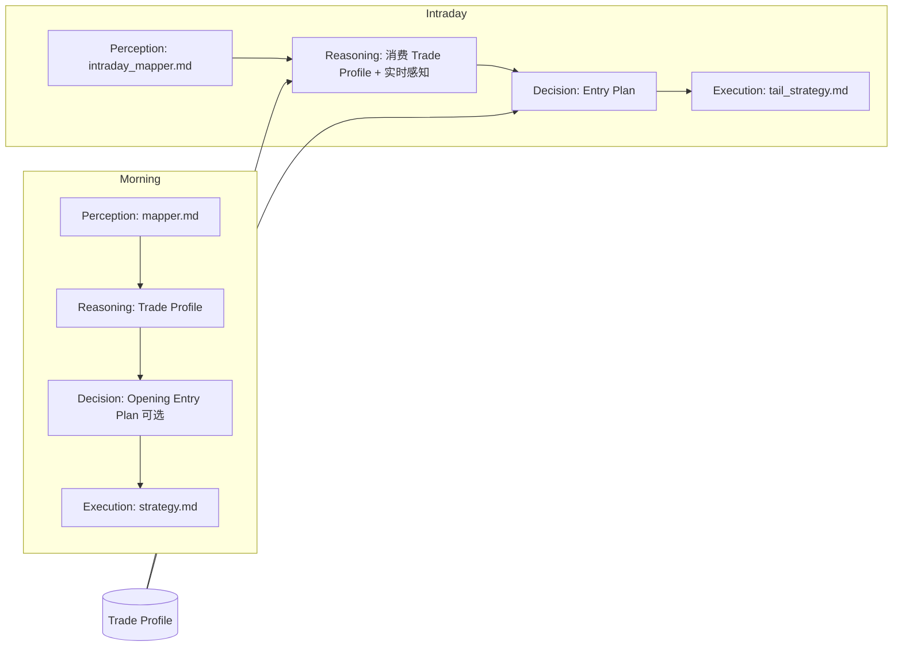
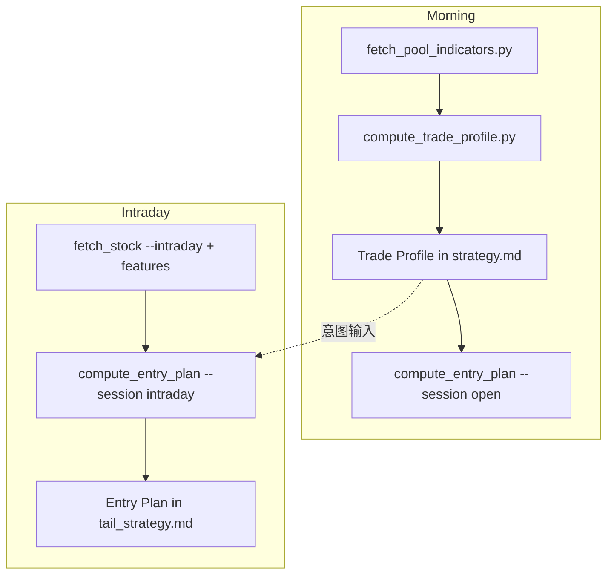

# Trade Profile → Entry Plan v1 — 交易画像与执行计划规范

> 日期：2026-06-27（v1.1 架构升级）  
> 状态：设计稿，待开发  
> 前身：ABZ（Adaptive Buy Zone）— 买入区间引擎保留为 Entry Plan 的 Compute 子模块  
> 适用范围：Morning `daily-strategy`（Trade Profile）+ Intraday `intraday-strategy`（Entry Plan）  
> 关联文档：`INTRADAY_AGENT_IMPLEMENTATION.md`、`daily-strategy/SKILL.md`、`memory/RULES.md`

---

## 0. 架构定位（v1.1 核心变更）

### 0.1 问题：不只是买区公式错

复盘表明：方向常对，但 **Morning 输出的静态价格区间当天即失效**（6/25 严格买入 0%）。根因不仅是 MA20 锚点选错，更是 **职责错位**——让 Morning 同时承担「交易意图」和「可执行价格」，后者必然在强势日踏空。

### 0.2 升级：两层分离

| 层级 | Agent | 回答的问题 | 输出 | 时效 |
|------|-------|------------|------|------|
| **交易画像** | Morning | 这只股票**适合怎么做**？ | `Trade Profile` | 全天有效（意图） |
| **执行计划** | Intraday | **现在**能不能做、怎么做、在哪做？ | `Entry Plan` | 14:30 实时（执行） |

```text
Morning Agent     →  Trade Profile   →  「怎么做」（意图，非静态价格）
Intraday Agent    →  Entry Plan      →  「现在能不能做、在哪做」（实时执行）
```

Morning **不再**预测当天很可能失效的静态 `Buy Zone`。具体价格区间由 Entry Plan 在实时数据上计算。

### 0.3 与 V5 四层架构对齐



| V5 层 | Morning | Intraday |
|-------|---------|----------|
| Perception | mapper.md | intraday_mapper.md + market_snapshot |
| Reasoning | Direction / RiskSeverity / **Trade Profile** | Tradeability 校验 + Profile 匹配度 |
| Decision | Opening Entry Plan（9:25 竞价后，可选） | **Entry Plan**（14:30 主执行） |
| Execution | strategy.md 格式化 | tail_strategy.md 格式化 |

**Invariant**：Trade Profile 是 Reasoning 产物；Entry Plan 是 Decision 产物（Python `compute_entry_plan.py` + Step3 确认），Execution 层不得新增价格信息。

### 0.4 Morning 与 Intraday 关系

```text
strategy.md 中的 Trade Profile
    │
    │  可选对照（Tracking Pool / Prediction Review）
    ▼
intraday_mapper.md + 实时行情
    │
    ▼
tail_strategy.md 中的 Entry Plan（独立推理，Profile 作意图输入非绑架）
```

- Trade Profile **存在** → Intraday 优先匹配画像标的，并标注 `ProfileMatch`
- Trade Profile **不存在** → Intraday 纯 Discovery，仍可产出完整 Entry Plan
- Morning 静态价格区间 **废止**；复盘「可执行」口径以 Entry Plan 为准

---

## 1. 背景与问题

### 1.1 现状

当前 `daily-strategy/SKILL.md` 将买入区间写死为：

```
买入区间 = [MA20, MA20 + 0.5×ATR]
```

`INTRADAY_RULES.md` 草案 I07 沿用同一公式。`memory/RULES.md` 中已有碎片化补丁：

| 规则 | 内容 | 工程状态 |
|------|------|----------|
| R32 | 高开 +3~5% 区间上移 | 仅 RULES，SKILL 未下沉 |
| R35-v4 | 涨停次日高开分档试探 | LLM 临场应用，不稳定 |
| R68 | 强势趋势日 MA20→MA5 | RULES 有，脚本无 `ma5` 字段 |
| R69 | 近端踏空尾盘 0.5% 追入 | 拟迁入 INTRADAY I07 |
| R70 | 弱市入区 30 分钟观测 | 与买区公式未联动 |
| I07 | 尾盘仍绑 MA20 | 14:30 强势股大量 `—` |

### 1.2 复盘证据（6/24–6/26）

| 日期 | 严格买入成功率 | 宽松（方向正确） | 典型问题 |
|------|:--------------:|:----------------:|----------|
| 6/24 | 12.5% | 20% | 方向 100% 对，87.5% MA20 踏空 |
| 6/25 | 0% | 90% | 10/10 方向对，0/10 触及 MA20 区（偏离 +13%~+42%） |
| 6/26 | 0% | 0% | 弱市入区崩溃（中兴/立讯） |

**结论**：不是方向错，是**职责错位**——Morning 不应输出当天即失效的静态价格区间。应改为：Morning 定 **Trade Profile**（怎么做），Intraday 在实时数据上定 **Entry Plan**（现在能不能做、在哪做）。

---

## 2. 设计目标

1. **职责分离**：Morning 产出 Trade Profile；Intraday 产出 Entry Plan
2. **一个引擎、三个时段**：`compute_entry_plan.py --session open|intraday`（ABZ 决策树作 intraday/open 子模块）
3. **先画像、后执行**：Profile 定意图（锚点偏好、追高风险、仓位预算）；Plan 定价格（BuyLo/Hi、Stop、Position）
4. **执行必有结论**：`ACTIONABLE` / `WAIT` / `NO_CHASE`，禁止模糊 `—`
5. **复盘双口径**：保留 `严格-MA20` 历史对照；主 KPI 为 `可执行-EntryPlan`
6. **规则收敛**：R32/R35/R68/R69/I07 分别落入 Profile 规则或 Plan 计算树

---

## 3. Trade Profile（Morning 产出）

### 3.1 定义

**Trade Profile** 描述一只推荐标的的**全天交易意图**，不含当日实时价格区间。

回答：「如果要做这只股票，应该用什么风格、什么锚点、多大仓位、什么情况下放弃？」

### 3.2 字段 schema

| 字段 | 类型 | 含义 | 示例 |
|------|------|------|------|
| `playbook` | enum | 交易剧本 | `PULLBACK` / `MOMENTUM` / `LIMIT_UP_CONT` / `DEFENSIVE` / `WATCH_ONLY` |
| `preferred_anchor` | enum | 首选支撑锚点 | `MA20` / `MA5` / `OPEN` / `FLEX` |
| `chase_policy` | enum | 追高政策 | `NO_CHASE` / `MA5_ONLY` / `OPEN_PROBE_OK` |
| `entry_window` | enum | 偏好入场窗口 | `OPEN` / `MORNING_DIP` / `TAIL` / `ANY` |
| `position_budget` | float | 仓位预算上限 | `0.02` (2%) |
| `stop_policy` | enum | 止损策略 | `ATR_1.5` / `ATR_2.0` / `PCT_R35` |
| `time_horizon` | enum | 持仓意图 | `T+0` / `T+1` / `SWING` |
| `invalidation` | str | 失效条件（≤50字） | `跌破MA20且板块热度<3★` |
| `ref_ma20` | float | 参考 MA20（非买区） | 531.92 |
| `ref_ma5` | float | 参考 MA5（非买区） | 735.0 |
| `ref_high20` | float | 参考 High20 | 705.09 |
| `max_extension_atr` | float | 允许偏离锚点上限（ATR 倍数） | 2.5 |

### 3.3 Playbook 与规则映射

| Playbook | 触发条件 | 隐含规则 |
|----------|----------|----------|
| `PULLBACK` | 震荡/弱市、PULLBACK 状态 | 默认 MA20、`chase_policy=NO_CHASE` |
| `MOMENTUM` | 主线 + 科创50>2% 或板块>2.5% | R68 → `preferred_anchor=MA5` |
| `LIMIT_UP_CONT` | 昨涨停 + 主线≥4★ | R35-v4 → `OPEN_PROBE_OK` |
| `DEFENSIVE` | 弱市但方向偏多 | R70 → `entry_window=MORNING_DIP`，观测 30min |
| `WATCH_ONLY` | Extended / RiskSeverity≥3 | 当日不交易，等 Intraday 或次日 |

### 3.4 Morning Reasoning 产出 Trade Profile（非价格）

Step3 `daily-strategy` 对每只 `comp≥55` 且 `Direction≠bearish` 的标的：

1. 读 Direction / RiskSeverity / RegimeHint / pattern.*
2. 读 RULES 语义匹配 → 选定 `playbook` + `chase_policy`
3. 写 Trade Profile 字段；**不写 BuyLo/BuyHi**
4. `ref_*` 列来自 Strategy Inputs（仅参考）

### 3.5 `strategy.md` 新表结构（Execution 层）

```markdown
| Code | Name | Sector | Direction | Rating | Playbook | Anchor | Chase | EntryWindow | PosBudget | StopPolicy | Horizon | Invalidation |
| sh603986 | 兆易创新 | 半导体 | bullish | 5★ | MOMENTUM | MA5 | OPEN_PROBE_OK | OPEN | 2% | PCT_R35 | T+1 | 板块热度<4★或炸板 |
| sz000977 | 浪潮信息 | AI算力 | neutral-bull | 3★ | WATCH_ONLY | FLEX | NO_CHASE | TAIL | — | ATR_2.0 | T+1 | 龙头断板 |
```

**废止列**：`Buy Zone` / `Stop` / `Target1` / `Target2` 从 Morning 主表移除（或移入附录「参考价位」只读区，标注 *非执行*）。

### 3.6 Opening Entry Plan（可选，9:25 Decision 层）

若需在开盘执行（非仅尾盘），在 **竞价结束后** 单独跑：

```bash
python .../compute_entry_plan.py \
  --session open \
  --profile predict/{date}/strategy.md \
  --json
```

- 输入：Trade Profile + 实时 Open + 竞价数据
- 输出：当日开盘窗口的 Entry Plan（可能 `ACTIONABLE` 或 `WAIT`）
- 写入 `strategy.md` 附录段 `## Opening Entry Plan`，与主 Trade Profile 表分离
- **不替代** 14:30 Entry Plan；开盘未成交的标的由 Intraday 重新计划

---

## 4. Entry Plan（Intraday 产出）

### 4.1 定义

**Entry Plan** 在 14:30 实时数据上，回答：

- **能不能做**（`Tail Action` / `can_execute`）
- **怎么做**（`EntryMode`）
- **在哪做**（`BuyLo` / `BuyHi`）
- **多少**（`Position`）
- **止损**（`Stop`）

### 4.2 字段 schema

| 字段 | 类型 | 含义 |
|------|------|------|
| `can_execute` | bool | 是否允许执行 |
| `tail_action` | enum | `Recommend` / `Light` / `Wait` / `No Chase` / `Skip` |
| `buy_lo` / `buy_hi` | float? | 具体价格区间；`NO_CHASE` 时为 null |
| `anchor` | enum | 本次解析锚点：`MA20`/`MA5`/`VWAP`/`TAIL`/`OPEN` |
| `entry_mode` | enum | `LIMIT_IN_ZONE` / `TAIL_PROBE` / `MARKET_NOW` / `NO_CHASE` |
| `stop` | float? | 具体止损价 |
| `position` | float | 本次仓位（%） |
| `tomorrow_expect` | enum | I06 兑现概率档 |
| `profile_match` | enum | `Aligned` / `Degraded` / `Invalidated` / `New` |
| `profile_note` | str | 与 Morning Profile 的差异说明 |

### 4.3 Profile → Plan 决策流

```python
def entry_plan(ctx):
    profile = load_trade_profile(ctx.code)  # 可选，无则 New

    # 1. Intraday 感知硬过滤（独立于 Morning）
    if ctx.tradeability in ("Avoid", "Extended"):
        return no_chase(profile_match="Invalidated" if profile else "New")
    if ctx.tail_flow == "Outflow":
        return no_chase(...)

    # 2. Profile 意图约束
    if profile and profile.chase_policy == "NO_CHASE" and ctx.position_state == "EXTENDED":
        return no_chase(profile_match="Aligned")

    # 3. 解析锚点：Profile.preferred_anchor + 实时 PositionState
    anchor = resolve_anchor(profile, ctx)  # ABZ 决策树

    # 4. 计算具体价格（仅在此步出现 BuyLo/BuyHi）
    lo, hi = price_from_anchor(anchor, ctx)

    # 5. Tail Action 矩阵（I01/I05 + Profile.position_budget）
    action, pos = tail_action_matrix(ctx, profile)

    return EntryPlan(buy_lo=lo, buy_hi=hi, tail_action=action, position=pos, ...)
```

### 4.4 `tail_strategy.md` 表结构

```markdown
| # | Code | Name | Tradeability | ProfileMatch | Tail Action | Buy Zone | Anchor | EntryMode | Stop | Position | Tomorrow |
| 1 | sh603986 | 兆易创新 | Suitable | Aligned | Recommend | 768~775 | TAIL | TAIL_PROBE | 762 | 1.5% | High |
| 2 | sz000977 | 浪潮信息 | Watch | Degraded | Wait | — | — | WAIT | — | — | Moderate |
```

---

## 5. 共享 Compute 概念（ABZ 子模块）

`compute_entry_plan.py` 内部使用以下概念；**Morning Trade Profile 只引用枚举，不算具体价格**。

### 5.1 PositionState（位置状态）

由 Python 根据 `Price`（或 `Live`/`Open`）与 `MA20`、`ATR` 计算：

```text
dist_ma20 = (Price - MA20) / ATR

PULLBACK   dist_ma20 ≤ 1.0
TREND      1.0 < dist_ma20 ≤ 2.5
EXTENDED   dist_ma20 > 2.5
           OR (board_streak ≥ 2 AND Price ≥ High20 × 0.98)
GAP_UP     open_pct ≥ 3%（开盘）或 gap_from_prev ≥ 3%（尾盘）
```

### 5.2 Anchor（锚点类型 — Entry Plan 专用）

| Anchor | 区间公式 | 典型场景 |
|--------|----------|----------|
| `MA20` | `[MA20, MA20 + 0.5×ATR]` | 震荡/弱市回踩 |
| `MA5` | `[MA5, MA5 + 0.5×ATR]` | R68 强势主线 |
| `OPEN` | `[Open, Open + 0.3×ATR]` | R35 涨停次日（`--session open`） |
| `MA20_SHIFT` | `[MA20×(1+open_pct/100), 上沿+0.5×ATR]` | R32 高开 3~5% |
| `VWAP` | `[VWAP - 0.3×ATR, VWAP]` | 14:30 价在 MA5 之上 |
| `TAIL` | `[tail_low_30m, min(Live, tail_vwap_30m)]` | 尾盘强承接 |

### 5.3 EntryMode（入场方式）

| Mode | 含义 | 默认仓位系数 |
|------|------|:------------:|
| `LIMIT_IN_ZONE` | 等价格进入区间 | ×1.0 |
| `OPEN_PROBE` | 开盘站稳即试（R35） | ×0.5~1.0 |
| `TAIL_PROBE` | 14:30 尾盘试仓（替代 R69） | ×0.5 |
| `MARKET_NOW` | 当前价附近小窗执行 | ×0.5 |
| `WAIT` | 观察，当日不入 | 0 |
| `NO_CHASE` | Extended / 弱市追高禁止 | 0 |

### 5.4 PlanStatus（Entry Plan 输出状态）

| Status | 含义 |
|--------|------|
| `ACTIONABLE` | 有明确区间且允许入场 |
| `WAIT` | Tail Action=Wait / 条件未满足 |
| `NO_CHASE` | 不追高，Buy Zone 填「不追高」 |

---

## 6. 系统架构与数据流



**职责边界**：

| 组件 | 层 | 产出 |
|------|-----|------|
| `compute_trade_profile.py` | Morning Decision | Playbook / Anchor / Chase / PosBudget（无 BuyLo/Hi） |
| `compute_entry_plan.py --session open` | Morning Decision（可选） | 9:25 开盘 Entry Plan |
| `compute_entry_plan.py --session intraday` | Intraday Decision | 14:30 Entry Plan（含 BuyLo/Hi/Stop） |
| Step3 Reasoning | 两 Agent | 确认 / 覆盖 ProfileMatch；不得手改价格 |
| Execution | strategy.md / tail_strategy.md | 格式化输出 |

---

## 7. Morning：Trade Profile 计算树

### 7.1 输入

| 字段 | 来源 |
|------|------|
| `direction`, `risk_severity`, `regime` | Step3 Reasoning |
| `position_state`, `ma20`, `ma5`, `atr` | `fetch_pool_indicators.py` |
| `mainline`, `sector_heat` | mapper + themes |
| `yesterday_limit_up`, `board_streak` | Phase 2 |
| `open_pct`（若 9:25 后） | `fetch_stock.py` |

### 7.2 决策树（产出 Profile，非价格）

```python
def compute_trade_profile(ctx):
    state = position_state(ctx)

    if ctx.regime in ("weak", "panic"):
        if state == PULLBACK:
            return Profile(playbook="DEFENSIVE", anchor="MA20",
                           chase="NO_CHASE", entry_window="MORNING_DIP",
                           stop_policy="ATR_2.0", note="R70观测")
        return Profile(playbook="WATCH_ONLY", chase="NO_CHASE")

    if ctx.yesterday_limit_up and ctx.mainline and ctx.sector_heat >= 4:
        return Profile(playbook="LIMIT_UP_CONT", anchor="OPEN",
                       chase="OPEN_PROBE_OK", entry_window="OPEN",
                       stop_policy="PCT_R35", note="R35-v4")

    if ctx.mainline and (ctx.kcb_pct > 2.0 or ctx.sector_pct > 2.5):
        return Profile(playbook="MOMENTUM", anchor="MA5",
                       chase="MA5_ONLY", entry_window="OPEN",
                       max_extension_atr=2.5, note="R68")

    if state == EXTENDED:
        return Profile(playbook="WATCH_ONLY", chase="NO_CHASE",
                       entry_window="TAIL")

    return Profile(playbook="PULLBACK", anchor="MA20",
                   chase="NO_CHASE", entry_window="ANY",
                   stop_policy="ATR_1.5")
```

### 7.3 6/25 回溯：Profile vs 旧 Buy Zone

| 标的 | 涨幅 | 旧 MA20 区 | Trade Profile 预期 |
|------|:----:|:----------:|-------------------|
| 兆易创新 | +9.94% | 532–553 ❌ | MOMENTUM / MA5 / OPEN_PROBE_OK |
| 中科曙光 | 涨停 | 75–78 ❌ | MOMENTUM / MA5 / OPEN |
| 长电科技 | 涨停 | 79–82 ❌ | LIMIT_UP_CONT 或 MOMENTUM |
| 南大光电 | -2.96% | 未入区 | WATCH_ONLY 或 DEFENSIVE |

复盘时：Morning 验证 **Profile 是否正确**（剧本是否匹配走势），不验证是否触及 MA20。

---

## 8. Entry Plan 计算树（`compute_entry_plan.py`）

替代原 ABZ morning 分支 + I07。仅在 `--session open` 与 `--session intraday` 产出具体价格。

### 8.1 `--session open`（9:25，可选）

输入：Trade Profile + 实时 Open + 竞价涨幅。

```python
def entry_plan_open(ctx, profile):
    if profile.playbook == "WATCH_ONLY":
        return no_chase()
    if profile.playbook == "LIMIT_UP_CONT":
        # R35 分档 → 具体 OPEN 区间与止损（见 §5.2 OPEN anchor）
        return resolve_open_probe(ctx, profile)
    if profile.playbook == "MOMENTUM" and profile.anchor == "MA5":
        return resolve_ma5_zone(ctx, profile, mode="OPEN_PROBE")
    if profile.playbook == "DEFENSIVE":
        return resolve_ma20_zone(ctx, profile, mode="LIMIT_IN_ZONE", wait_r70=True)
    return resolve_by_profile_anchor(ctx, profile)
```

### 8.2 `--session intraday`（14:30，主执行）

输入：Trade Profile（可选）+ intraday_mapper 感知 + 分时特征。

额外字段：`live`, `vwap_day`, `tail_low_30m`, `tail_vwap_30m`, `tradeability`, `overnight_score`, `tail_flow`

前置过滤：

```text
Tradeability ∈ {Avoid, Extended}  → NO_CHASE, profile_match=Invalidated|New
TailFlow = Outflow                  → NO_CHASE
OvernightScore < 60                 → NO_CHASE
Profile.chase=NO_CHASE + EXTENDED   → NO_CHASE, profile_match=Aligned
```

决策树（ABZ 尾盘逻辑，产出价格）：

```python
def entry_plan_intraday(ctx, profile):
    # ... 前置过滤 ...

    state = position_state(ctx, price=ctx.live)
    anchor = resolve_anchor(profile, ctx, state)  # §5.2

    if ctx.tradeability == "Suitable" and ctx.overnight_score >= 75:
        if state == PULLBACK:
            return plan(anchor="MA20", mode="TAIL_PROBE", pos=min(0.02, profile.budget))
        if state == TREND:
            return plan(anchor="VWAP" if ctx.tail_vwap else "TAIL", mode="TAIL_PROBE")
        if state == EXTENDED and ctx.overnight_score >= 85:
            return plan(anchor="TAIL", mode="TAIL_PROBE", pos=0.005)  # 极小仓
        return no_chase(profile_match="Degraded")

    if ctx.tradeability == "Watch":
        return plan(mode="WAIT", profile_match="Degraded")

    return no_chase()
```

### 8.3 止损（Entry Plan 专用）

```text
默认: Stop = zone_lo - stop_mult × ATR
stop_mult: 取自 Profile.stop_policy（ATR_1.5 / ATR_2.0）

OPEN_PROBE (R35): Stop = Open × 0.97 或 × 0.98
TAIL_PROBE: Stop = tail_low_30m - 0.5×ATR（替代 R69）
```

### 8.4 R69 / I07 迁移

- R69 → `TAIL_PROBE` 分支（Entry Plan intraday）
- I07 MA20 静态买区 → **废止**；I07-v2 = Entry Plan intraday 规范

---

## 9. 工程落地

### 9.1 数据层扩展

#### `fetch_pool_indicators.py` 新增输出

```text
ma5, prev_close, dist_ma20_atr, position_state, yesterday_limit_up
```

#### 尾盘特征

`compute_intraday_features.py`：

```text
vwap_day, tail_low_30m, tail_vwap_30m, tail_vol_ratio
```

### 9.2 新脚本（两个，职责分离）

```bash
# Morning：Trade Profile（无价格）
python .opencode/skills/daily-stock-mapping/scripts/compute_trade_profile.py \
  sh603986,sz000977 --regime neutral --date 2026-06-25 --json

# Decision：Entry Plan（含价格）
python .opencode/skills/daily-stock-mapping/scripts/compute_entry_plan.py \
  sh603986,sz000977 --session open --profile predict/2026-06-25/strategy.md --json

python .opencode/skills/daily-stock-mapping/scripts/compute_entry_plan.py \
  sh603986,sz000977 --session intraday --profile predict/2026-06-25/strategy.md --json
```

#### Trade Profile JSON 示例

```json
{
  "code": "sh603986",
  "playbook": "MOMENTUM",
  "preferred_anchor": "MA5",
  "chase_policy": "OPEN_PROBE_OK",
  "entry_window": "OPEN",
  "position_budget": 0.02,
  "stop_policy": "PCT_R35",
  "time_horizon": "T+1",
  "invalidation": "板块热度<4★或炸板",
  "ref_ma20": 531.92,
  "ref_ma5": 735.0,
  "max_extension_atr": 2.5
}
```

#### Entry Plan JSON 示例

```json
{
  "code": "sh603986",
  "buy_lo": 768.0,
  "buy_hi": 775.0,
  "anchor": "TAIL",
  "entry_mode": "TAIL_PROBE",
  "plan_status": "ACTIONABLE",
  "tail_action": "Recommend",
  "stop": 762.0,
  "position": 0.015,
  "profile_match": "Aligned",
  "profile_note": "MOMENTUM剧本，尾盘TAIL承接"
}
```

### 9.3 mapper / strategy 落盘

| 文件 | 新增内容 |
|------|----------|
| `mapper.md` §4 | `ref_ma20/ma5`（参考价，非买区） |
| `strategy.md` 主表 | **Trade Profile 列**（§3.5） |
| `strategy.md` 附录 | `Opening Entry Plan`（可选，`--session open`） |
| `intraday_mapper.md` | 无 BuyLo/Hi（感知层） |
| `tail_strategy.md` | **Entry Plan 列**（§4.4） |

### 9.4 SKILL 修改要点

#### `daily-strategy/SKILL.md`

- **废止** § Buy / Stop / Target 固定公式主表输出
- **新增** Trade Profile 生成流程 + `compute_trade_profile.py` 调用
- Red Flag：主表出现 `Buy Zone` 具体价格 → 违规

#### `intraday-strategy/SKILL.md` / `INTRADAY_RULES.md`

- I07 废止 → **I07-v2** = Entry Plan 规范
- Step3 读 `strategy.md` Trade Profile + `intraday_mapper.md` → `compute_entry_plan.py`
- Red Flag：未跑 Entry Plan 脚本即手写 Buy Zone → 违规

---

## 10. Prediction Review 扩展

Intraday `tail_strategy.md` 的 Prediction Review 升级为三维对照：

| Morning | Intraday | Status |
|---------|----------|--------|
| Trade Profile (Playbook) | Entry Plan (Tail Action) | Aligned / Degraded / Invalidated |
| Direction | ProfileMatch + 收盘表现 | Strengthened / Failed |
| Rating | Position 实际执行 | Confirmed / Skipped |

Morning 不再因「未触及 MA20」标 Failed；改为验证 **Profile 剧本是否成立**。

---

## 11. 规则整合映射

| 旧规则 | Trade Profile | Entry Plan |
|--------|:-------------:|:----------:|
| R32 高开上移 | `playbook` 调整 | `MA20_SHIFT` anchor（open） |
| R35-v4 | `LIMIT_UP_CONT` | `OPEN_PROBE`（open） |
| R56-v2 | `chase=NO_CHASE` | `no_chase` |
| R68 | `MOMENTUM` + `MA5` | `resolve_ma5_zone` |
| R69 | — | `TAIL_PROBE`（intraday） |
| R70 | `DEFENSIVE` + `MORNING_DIP` | R70 wait flag（open） |
| I07 | — | **废止** → I07-v2 |
| I04 | `WATCH_ONLY` | `NO_CHASE` |

---

## 12. 复盘口径

### Morning `verification.md`

| 口径 | 定义 |
|------|------|
| **Profile 准确率** | Playbook 与当日走势分类一致（如 MOMENTUM 日收盘强于板块） |
| **方向准确率** | 不变 |
| 严格-MA20 | 保留历史对照，**不作 Morning 主 KPI** |

### Intraday `intraday_verification.md`

| 口径 | 定义 |
|------|------|
| **可执行-EntryPlan** | 满足 EntryMode 入场条件（主 KPI） |
| **ProfileMatch 率** | Aligned / Degraded / Invalidated 分布 |
| T+1 兑现 | I06 Tomorrow Expectation 验证 |

---

## 13. 实施顺序

| 阶段 | 任务 |
|:----:|------|
| P0 | `fetch_pool_indicators` 加 `ma5` / `position_state` |
| P0 | `compute_trade_profile.py` + 改 `daily-strategy` 主表 |
| P0 | 6/24–6/26 回测：Profile 准确率 + 对比旧 MA20 口径 |
| P1 | `compute_entry_plan.py --session open`（可选开盘执行） |
| P2 | `compute_intraday_features.py` + `--session intraday` |
| P2 | `intraday-strategy` + I07-v2 + `tail_strategy.md` 新表 |
| P3 | verification 双文件口径 + Prediction Review 三维 |

---

## 14. 验收标准

- [ ] `strategy.md` 主表无 `Buy Zone` 列，仅有 Trade Profile 字段
- [ ] `tail_strategy.md` 所有 Recommend 行有 Entry Plan（价格或「不追高」）
- [ ] 6/25 Morning：Profile 准确率（MOMENTUM 标的 ≥80% 识别正确）
- [ ] 6/25 Intraday：可执行-EntryPlan 显著优于严格-MA20
- [ ] 6/26 弱市：DEFENSIVE / WATCH_ONLY 不产出错误 Recommend
- [ ] ReasoningTrace 含 `ProfileTrace`（Morning）/ `PlanTrace`（Intraday）

---

## 15. 一句话总结

**Morning 定剧本（Trade Profile）**：用什么风格、什么锚点、多大仓位、何时放弃——**不给静态价格**。  
**Intraday 定执行（Entry Plan）**：现在能不能做、在哪做、多少止损——**在实时数据上算价格**。  
**工程**：`compute_trade_profile.py` + `compute_entry_plan.py`，与 V5 四层（Perception → Reasoning → Decision → Execution）对齐；ABZ 锚点逻辑下沉为 Entry Plan 的 Compute 子模块。
